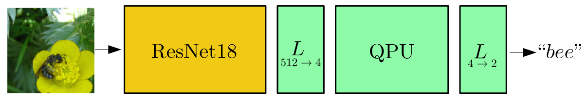

.. note::
    :class: sphx-glr-download-link-note

    Click :ref:`here <sphx_glr_download_app_tutorial_quantum_transfer_learning.py>` to download the full example code
.. rst-class:: sphx-glr-example-title

.. _sphx_glr_app_tutorial_quantum_transfer_learning.py:

.. _quantum_transfer_learning:

Quantum transfer learning
=========================

In this tutorial we apply a machine learning method, known as *transfer learning*, to an
image classifier based on a hybrid classical-quantum network.

This example follows the general structure of the PyTorch
`tutorial on transfer learning <https://pytorch.org/tutorials/beginner/transfer_learning_tutorial.html>`_
by Sasank Chilamkurthy, with the crucial difference of using a quantum circuit to perform the
final classification task.

More details on this topic can be found in the research paper [1] (`Mari et al. (2019) <https://arxiv.org/abs/1912.08278>`_).

Introduction
------------

Transfer learning is a well-established technique for training artificial neural networks (see e.g., Ref. [2]),
which is based on the general intuition that if a pre-trained network is good at solving a
given problem, then, with just a bit of additional training, it can be used to also solve a different
but related problem.

As discussed in Ref. [1], this idea can be formalized in terms of two abstract netwoks :math:`A`
and :math:`B`, independently from their quantum or classical physical nature.

|

.. figure:: ../implementations/quantum_transfer_learning/transfer_learning_general.png
   :scale: 45%
   :alt: transfer_general
   :align: center

|

As sketched in the above figure, one can give the following **general definition of the
transfer learning method**:

1. Take a network :math:`A` that has been pre-trained on a dataset :math:`D_A` and for a given
   task :math:`T_A`.

2. Remove some of the final layers. In this way, the resulting truncated network :math:`A'`
   can be used as a feature extractor.

3. Connect a new trainable network :math:`B` at the end of the pre-trained network :math:`A'`.

4. Keep the weights of :math:`A'` constant, and train the final block :math:`B` with a
   new dataset :math:`D_B` and/or for a new task of interest :math:`T_B`.

When dealing with hybrid systems, depending on the physical nature (classical or quantum) of the
networks :math:`A` and :math:`B`, one can have different implementations of transfer learning as
summarized in following table:

|

.. rst-class:: docstable

+-----------+-----------+-----------------------------------------------------+
| Network A | Network B | Tansfer learning scheme                             |
+===========+===========+=====================================================+
| Classical | Classical | CC - Standard classical method. See e.g., Ref. [2]. |
+-----------+-----------+-----------------------------------------------------+
| Classical | Quantum   | CQ - **Hybrid model presented in this tutorial.**   |
+-----------+-----------+-----------------------------------------------------+
| Quantum   | Classical | QC - Model studied in Ref. [1].                     |
+-----------+-----------+-----------------------------------------------------+
| Quantum   | Quantum   | QQ - Model studied in Ref. [1].                     |
+-----------+-----------+-----------------------------------------------------+

Classical-to-quantum transfer learning
--------------------------------------

We focus on the CQ transfer learning scheme discussed in the previous section and we give a specific example.

1. As pre-trained network :math:`A` we use **ResNet18**, a deep residual neural network introduced by
   Microsoft in Ref. [3], which is pre-trained on the *ImageNet* dataset.

2. After removing its final layer we obtain :math:`A'`, a pre-processing block which maps any
   input high-resolution image into 512 abstract features.

3. Such features are classified by a 4-qubit "dressed quantum circuit" :math:`B`, i.e., a
   variational quantum circuit sandwiched between two classical layers.

4. The hybrid model is trained, keeping :math:`A'` constant, on the *Hymenoptera* dataset
   (a small subclass of ImageNet) containing images of *ants* and *bees*.

A graphical representation of the full data processing pipeline is given in the figure below.

General setup
------------------------

.. note::

   To use the PyTorch interface in PennyLane, you must first
   `install PyTorch <https://pytorch.org/get-started/locally/#start-locally>`_.

In addition to *PennyLane*, we will also need some standard *PyTorch* libraries and the
plotting library *matplotlib*.

.. code-block:: default

    # Some parts of this code are based on the Python script:
    # https://github.com/pytorch/tutorials/blob/master/beginner_source/transfer_learning_tutorial.py
    # License: BSD

    # Plotting
    import matplotlib.pyplot as plt

    # PyTorch
    import torch
    import torch.nn as nn
    import torch.optim as optim
    from torch.optim import lr_scheduler
    import torchvision
    from torchvision import datasets, models, transforms

    # Pennylane
    import pennylane as qml
    from pennylane import numpy as np

    # Other tools
    import time
    import os
    import copy

    # OpenMP: number of parallel threads.
    os.environ["OMP_NUM_THREADS"] = "1"

Setting of the main hyper-parameters of the model
------------------------------------------------------------

.. note::
  To reproduce the results of Ref. [1], ``num_epochs`` should be set to ``30`` which may take a long time.
  We suggest to first try with ``num_epochs=1`` and, if everything runs smoothly, increase it to a larger value.

.. code-block:: default

    n_qubits = 4                # Number of qubits
    step = 0.0004               # Learning rate
    batch_size = 4              # Number of samples for each training step
    num_epochs = 1              # Number of training epochs
    q_depth = 6                 # Depth of the quantum circuit (number of variational layers)
    gamma_lr_scheduler = 0.1    # Learning rate reduction applied every 10 epochs.
    q_delta = 0.01              # Initial spread of random quantum weights
    rng_seed = 0                # Seed for random number generator
    start_time = time.time()    # Start of the computation timer

We initialize a PennyLane device with a ``default.qubit`` backend.

.. code-block:: default

    dev = qml.device("default.qubit", wires=n_qubits)

We configure PyTorch to use CUDA only if available. Otherwise the CPU is used.

.. code-block:: default

    device = torch.device("cuda:0" if torch.cuda.is_available() else "cpu")

Dataset loading
------------------------------------------------------------

.. note::
    The dataset containing images of *ants* and *bees* can be downloaded
    `here <https://download.pytorch.org/tutorial/hymenoptera_data.zip>`_ and
    should be extracted in the subfolder ``../_data/hymenoptera_data``.

This is a very small dataset (roughly 250 images), too small for training from scratch a
classical or quantum model, however it is enough when using *transfer learning* approach.

The PyTorch packages ``torchvision`` and ``torch.utils.data`` are used for loading the dataset
and performing standard preliminary image operations: resize, center, crop, normalize, *etc.*

.. code-block:: default

    data_transforms = {
        "train": transforms.Compose(
            [
                # transforms.RandomResizedCrop(224),     # uncomment for data augmentation
                # transforms.RandomHorizontalFlip(),     # uncomment for data augmentation
                transforms.Resize(256),
                transforms.CenterCrop(224),
                transforms.ToTensor(),
                # Normalize input channels using mean values and standard deviations of ImageNet.
                transforms.Normalize([0.485, 0.456, 0.406], [0.229, 0.224, 0.225]),
            ]
        ),
        "val": transforms.Compose(
            [
                transforms.Resize(256),
                transforms.CenterCrop(224),
                transforms.ToTensor(),
                transforms.Normalize([0.485, 0.456, 0.406], [0.229, 0.224, 0.225]),
            ]
        ),
    }

    data_dir = "../_data/hymenoptera_data"
    image_datasets = {
        x: datasets.ImageFolder(os.path.join(data_dir, x), data_transforms[x]) for x in ["train", "val"]
    }
    dataset_sizes = {x: len(image_datasets[x]) for x in ["train", "val"]}
    class_names = image_datasets["train"].classes

    # Initialize dataloader
    dataloaders = {
        x: torch.utils.data.DataLoader(image_datasets[x], batch_size=batch_size, shuffle=True)
        for x in ["train", "val"]
    }

    # function to plot images
    def imshow(inp, title=None):
        """Display image from tensor."""
        inp = inp.numpy().transpose((1, 2, 0))
        # Inverse of the initial normalization operation.
        mean = np.array([0.485, 0.456, 0.406])
        std = np.array([0.229, 0.224, 0.225])
        inp = std * inp + mean
        inp = np.clip(inp, 0, 1)
        plt.imshow(inp)
        if title is not None:
            plt.title(title)

Let us show a batch of the test data, just to have an idea of the classification problem.

.. code-block:: default

    # Get a batch of training data
    inputs, classes = next(iter(dataloaders["val"]))

    # Make a grid from batch
    out = torchvision.utils.make_grid(inputs)

    imshow(out, title=[class_names[x] for x in classes])

    # In order to get reproducible results, we set a manual seed for the
    # random number generator and re-initialize the dataloaders.

    torch.manual_seed(rng_seed)
    dataloaders = {
        x: torch.utils.data.DataLoader(image_datasets[x], batch_size=batch_size, shuffle=True)
        for x in ["train", "val"]
    }

.. image:: /app/images/sphx_glr_tutorial_quantum_transfer_learning_001.png
    :class: sphx-glr-single-img

Variational quantum circuit
------------------------------------
We first define some quantum layers that will compose the quantum circuit.

.. code-block:: default

    def H_layer(nqubits):
        """Layer of single-qubit Hadamard gates.
        """
        for idx in range(nqubits):
            qml.Hadamard(wires=idx)

    def RY_layer(w):
        """Layer of parametrized qubit rotations around the y axis.
        """
        for idx, element in enumerate(w):
            qml.RY(element, wires=idx)

    def entangling_layer(nqubits):
        """Layer of CNOTs followed by another shifted layer of CNOT.
        """
        # In other words it should apply something like :
        # CNOT  CNOT  CNOT  CNOT...  CNOT
        #   CNOT  CNOT  CNOT...  CNOT
        for i in range(0, nqubits - 1, 2):  # Loop over even indices: i=0,2,...N-2
            qml.CNOT(wires=[i, i + 1])
        for i in range(1, nqubits - 1, 2):  # Loop over odd indices:  i=1,3,...N-3
            qml.CNOT(wires=[i, i + 1])

Now we define the quantum circuit through the PennyLane `qnode` decorator .

The structure is that of a typical variational quantum circuit:

* **Embedding layer:** All qubits are first initialized in a balanced superposition
  of *up* and *down* states, then they are rotated according to the input parameters
  (local embedding).

* **Variational layers:** A sequence of trainable rotation layers and constant
  entangling layers is applied.

* **Measurement layer:** For each qubit, the local expectation value of the :math:`Z`
  operator is measured. This produces a classical output vector, suitable for
  additional post-processing.

.. code-block:: default

    @qml.qnode(dev, interface="torch")
    def q_net(q_in, q_weights_flat):

        # Reshape weights
        q_weights = q_weights_flat.reshape(q_depth, n_qubits)

        # Start from state |+> , unbiased w.r.t. |0> and |1>
        H_layer(n_qubits)

        # Embed features in the quantum node
        RY_layer(q_in)

        # Sequence of trainable variational layers
        for k in range(q_depth):
            entangling_layer(n_qubits)
            RY_layer(q_weights[k])

        # Expectation values in the Z basis
        exp_vals = [qml.expval(qml.PauliZ(position)) for position in range(n_qubits)]
        return tuple(exp_vals)

Dressed quantum circuit
------------------------

We can now define a custom ``torch.nn.Module`` representing a *dressed* quantum circuit.

This is a concatenation of:

* A classical pre-processing layer (``nn.Linear``).
* A classical activation function (``torch.tanh``).
* A constant ``np.pi/2.0`` scaling.
* The previously defined quantum circuit (``q_net``).
* A classical post-processing layer (``nn.Linear``).

The input of the module is a batch of vectors with 512 real parameters (features) and
the output is a batch of vectors with two real outputs (associated with the two classes
of images: *ants* and *bees*).

.. code-block:: default

    class Quantumnet(nn.Module):
        def __init__(self):
            super().__init__()
            self.pre_net = nn.Linear(512, n_qubits)
            self.q_params = nn.Parameter(q_delta * torch.randn(q_depth * n_qubits))
            self.post_net = nn.Linear(n_qubits, 2)

        def forward(self, input_features):
            pre_out = self.pre_net(input_features)
            q_in = torch.tanh(pre_out) * np.pi / 2.0

            # Apply the quantum circuit to each element of the batch and append to q_out
            q_out = torch.Tensor(0, n_qubits)
            q_out = q_out.to(device)
            for elem in q_in:
                q_out_elem = q_net(elem, self.q_params).float().unsqueeze(0)
                q_out = torch.cat((q_out, q_out_elem))
            return self.post_net(q_out)

Hybrid classical-quantum model
------------------------------------

We are finally ready to build our full hybrid classical-quantum network.
We follow the *transfer learning* approach:

1. First load the classical pre-trained network *ResNet18* from the ``torchvision.models`` zoo.
2. Freeze all the weights since they should not be trained.
3. Replace the last fully connected layer with our trainable dressed quantum circuit (``Quantumnet``).

.. note::
  The *ResNet18* model is automatically downloaded by PyTorch and it may take several minutes (only the first time).

.. code-block:: default

    model_hybrid = torchvision.models.resnet18(pretrained=True)

    for param in model_hybrid.parameters():
        param.requires_grad = False

    # Notice that model_hybrid.fc is the last layer of ResNet18
    model_hybrid.fc = Quantumnet()

    # Use CUDA or CPU according to the "device" object.
    model_hybrid = model_hybrid.to(device)

Training and results
------------------------

Before training the network we need to specify the *loss* function.

We use, as usual in classification problem, the *cross-entropy* which is
directly available within ``torch.nn``.

.. code-block:: default

    criterion = nn.CrossEntropyLoss()

We also initialize the *Adam optimizer* which is called at each training step
in order to update the weights of the model.

.. code-block:: default

    optimizer_hybrid = optim.Adam(model_hybrid.fc.parameters(), lr=step)

We schedule to reduce the learning rate by a factor of ``gamma_lr_scheduler``
every 10 epochs.

.. code-block:: default

    exp_lr_scheduler = lr_scheduler.StepLR(optimizer_hybrid, step_size=10, gamma=gamma_lr_scheduler)

What follows is a training function that will be called later.
This function should return a trained model that can be used to make predictions
(classifications).

.. code-block:: default

    def train_model(model, criterion, optimizer, scheduler, num_epochs):
        since = time.time()
        best_model_wts = copy.deepcopy(model.state_dict())
        best_acc = 0.0
        best_loss = 10000.0  # Large arbitrary number
        best_acc_train = 0.0
        best_loss_train = 10000.0  # Large arbitrary number
        print("Training started:")

        for epoch in range(num_epochs):

            # Each epoch has a training and validation phase
            for phase in ["train", "val"]:
                if phase == "train":
                    scheduler.step()
                    # Set model to training mode
                    model.train()
                else:
                    # Set model to evaluate mode
                    model.eval()
                running_loss = 0.0
                running_corrects = 0

                # Iterate over data.
                n_batches = dataset_sizes[phase] // batch_size
                it = 0
                for inputs, labels in dataloaders[phase]:
                    since_batch = time.time()
                    batch_size_ = len(inputs)
                    inputs = inputs.to(device)
                    labels = labels.to(device)
                    optimizer.zero_grad()

                    # Track/compute gradient and make an optimization step only when training
                    with torch.set_grad_enabled(phase == "train"):
                        outputs = model(inputs)
                        _, preds = torch.max(outputs, 1)
                        loss = criterion(outputs, labels)
                        if phase == "train":
                            loss.backward()
                            optimizer.step()

                    # Print iteration results
                    running_loss += loss.item() * batch_size_
                    batch_corrects = torch.sum(preds == labels.data).item()
                    running_corrects += batch_corrects
                    print(
                        "Phase: {} Epoch: {}/{} Iter: {}/{} Batch time: {:.4f}".format(
                            phase,
                            epoch + 1,
                            num_epochs,
                            it + 1,
                            n_batches + 1,
                            time.time() - since_batch,
                        ),
                        end="\r",
                        flush=True,
                    )
                    it += 1

                # Print epoch results
                epoch_loss = running_loss / dataset_sizes[phase]
                epoch_acc = running_corrects / dataset_sizes[phase]
                print(
                    "Phase: {} Epoch: {}/{} Loss: {:.4f} Acc: {:.4f}        ".format(
                        "train" if phase == "train" else "val  ",
                        epoch + 1,
                        num_epochs,
                        epoch_loss,
                        epoch_acc,
                    )
                )

                # Check if this is the best model wrt previous epochs
                if phase == "val" and epoch_acc > best_acc:
                    best_acc = epoch_acc
                    best_model_wts = copy.deepcopy(model.state_dict())
                if phase == "val" and epoch_loss < best_loss:
                    best_loss = epoch_loss
                if phase == "train" and epoch_acc > best_acc_train:
                    best_acc_train = epoch_acc
                if phase == "train" and epoch_loss < best_loss_train:
                    best_loss_train = epoch_loss

        # Print final results
        model.load_state_dict(best_model_wts)
        time_elapsed = time.time() - since
        print("Training completed in {:.0f}m {:.0f}s".format(time_elapsed // 60, time_elapsed % 60))
        print("Best test loss: {:.4f} | Best test accuracy: {:.4f}".format(best_loss, best_acc))
        return model

We are ready to perform the actual training process.

.. code-block:: default

    model_hybrid = train_model(
        model_hybrid, criterion, optimizer_hybrid, exp_lr_scheduler, num_epochs=num_epochs
    )

.. rst-class:: sphx-glr-script-out

 Out:

 .. code-block:: none

    Training started:
    Phase: train Epoch: 1/1 Iter: 1/62 Batch time: 1.3485
    Phase: train Epoch: 1/1 Iter: 2/62 Batch time: 1.3802
    Phase: train Epoch: 1/1 Iter: 3/62 Batch time: 1.4415
    Phase: train Epoch: 1/1 Iter: 4/62 Batch time: 2.5556
    Phase: train Epoch: 1/1 Iter: 5/62 Batch time: 3.1536
    Phase: train Epoch: 1/1 Iter: 6/62 Batch time: 1.9560
    Phase: train Epoch: 1/1 Iter: 7/62 Batch time: 1.8501
    Phase: train Epoch: 1/1 Iter: 8/62 Batch time: 1.6426
    Phase: train Epoch: 1/1 Iter: 9/62 Batch time: 1.8133
    Phase: train Epoch: 1/1 Iter: 10/62 Batch time: 1.9965
    Phase: train Epoch: 1/1 Iter: 11/62 Batch time: 2.5088
    Phase: train Epoch: 1/1 Iter: 12/62 Batch time: 2.4117
    Phase: train Epoch: 1/1 Iter: 13/62 Batch time: 2.1562
    Phase: train Epoch: 1/1 Iter: 14/62 Batch time: 1.7785
    Phase: train Epoch: 1/1 Iter: 15/62 Batch time: 1.7715
    Phase: train Epoch: 1/1 Iter: 16/62 Batch time: 2.0217
    Phase: train Epoch: 1/1 Iter: 17/62 Batch time: 2.3027
    Phase: train Epoch: 1/1 Iter: 18/62 Batch time: 1.7978
    Phase: train Epoch: 1/1 Iter: 19/62 Batch time: 2.0186
    Phase: train Epoch: 1/1 Iter: 20/62 Batch time: 1.9142
    Phase: train Epoch: 1/1 Iter: 21/62 Batch time: 1.7646
    Phase: train Epoch: 1/1 Iter: 22/62 Batch time: 2.2784
    Phase: train Epoch: 1/1 Iter: 23/62 Batch time: 2.5601
    Phase: train Epoch: 1/1 Iter: 24/62 Batch time: 2.5831
    Phase: train Epoch: 1/1 Iter: 25/62 Batch time: 2.4915
    Phase: train Epoch: 1/1 Iter: 26/62 Batch time: 1.9534
    Phase: train Epoch: 1/1 Iter: 27/62 Batch time: 2.0473
    Phase: train Epoch: 1/1 Iter: 28/62 Batch time: 1.8282
    Phase: train Epoch: 1/1 Iter: 29/62 Batch time: 1.9030
    Phase: train Epoch: 1/1 Iter: 30/62 Batch time: 2.1323
    Phase: train Epoch: 1/1 Iter: 31/62 Batch time: 1.8727
    Phase: train Epoch: 1/1 Iter: 32/62 Batch time: 1.8234
    Phase: train Epoch: 1/1 Iter: 33/62 Batch time: 2.0340
    Phase: train Epoch: 1/1 Iter: 34/62 Batch time: 1.8022
    Phase: train Epoch: 1/1 Iter: 35/62 Batch time: 1.7258
    Phase: train Epoch: 1/1 Iter: 36/62 Batch time: 1.7471
    Phase: train Epoch: 1/1 Iter: 37/62 Batch time: 1.8483
    Phase: train Epoch: 1/1 Iter: 38/62 Batch time: 2.1816
    Phase: train Epoch: 1/1 Iter: 39/62 Batch time: 2.0795
    Phase: train Epoch: 1/1 Iter: 40/62 Batch time: 1.9297
    Phase: train Epoch: 1/1 Iter: 41/62 Batch time: 1.8262
    Phase: train Epoch: 1/1 Iter: 42/62 Batch time: 1.9396
    Phase: train Epoch: 1/1 Iter: 43/62 Batch time: 1.8944
    Phase: train Epoch: 1/1 Iter: 44/62 Batch time: 1.8640
    Phase: train Epoch: 1/1 Iter: 45/62 Batch time: 1.7411
    Phase: train Epoch: 1/1 Iter: 46/62 Batch time: 1.8625
    Phase: train Epoch: 1/1 Iter: 47/62 Batch time: 1.8677
    Phase: train Epoch: 1/1 Iter: 48/62 Batch time: 2.1919
    Phase: train Epoch: 1/1 Iter: 49/62 Batch time: 2.0782
    Phase: train Epoch: 1/1 Iter: 50/62 Batch time: 1.8336
    Phase: train Epoch: 1/1 Iter: 51/62 Batch time: 1.7651
    Phase: train Epoch: 1/1 Iter: 52/62 Batch time: 1.8509
    Phase: train Epoch: 1/1 Iter: 53/62 Batch time: 1.9921
    Phase: train Epoch: 1/1 Iter: 54/62 Batch time: 1.6999
    Phase: train Epoch: 1/1 Iter: 55/62 Batch time: 1.7880
    Phase: train Epoch: 1/1 Iter: 56/62 Batch time: 1.7450
    Phase: train Epoch: 1/1 Iter: 57/62 Batch time: 1.8039
    Phase: train Epoch: 1/1 Iter: 58/62 Batch time: 1.7160
    Phase: train Epoch: 1/1 Iter: 59/62 Batch time: 1.7922
    Phase: train Epoch: 1/1 Iter: 60/62 Batch time: 1.8921
    Phase: train Epoch: 1/1 Iter: 61/62 Batch time: 1.7660
    Phase: train Epoch: 1/1 Loss: 0.6916 Acc: 0.5164        
    Phase: val Epoch: 1/1 Iter: 1/39 Batch time: 0.3175
    Phase: val Epoch: 1/1 Iter: 2/39 Batch time: 0.2353
    Phase: val Epoch: 1/1 Iter: 3/39 Batch time: 0.2372
    Phase: val Epoch: 1/1 Iter: 4/39 Batch time: 0.2718
    Phase: val Epoch: 1/1 Iter: 5/39 Batch time: 0.4060
    Phase: val Epoch: 1/1 Iter: 6/39 Batch time: 0.3385
    Phase: val Epoch: 1/1 Iter: 7/39 Batch time: 0.2541
    Phase: val Epoch: 1/1 Iter: 8/39 Batch time: 0.2417
    Phase: val Epoch: 1/1 Iter: 9/39 Batch time: 0.2392
    Phase: val Epoch: 1/1 Iter: 10/39 Batch time: 0.2358
    Phase: val Epoch: 1/1 Iter: 11/39 Batch time: 0.2368
    Phase: val Epoch: 1/1 Iter: 12/39 Batch time: 0.2397
    Phase: val Epoch: 1/1 Iter: 13/39 Batch time: 0.2764
    Phase: val Epoch: 1/1 Iter: 14/39 Batch time: 0.2505
    Phase: val Epoch: 1/1 Iter: 15/39 Batch time: 0.2802
    Phase: val Epoch: 1/1 Iter: 16/39 Batch time: 0.2440
    Phase: val Epoch: 1/1 Iter: 17/39 Batch time: 0.2744
    Phase: val Epoch: 1/1 Iter: 18/39 Batch time: 0.2521
    Phase: val Epoch: 1/1 Iter: 19/39 Batch time: 0.2482
    Phase: val Epoch: 1/1 Iter: 20/39 Batch time: 0.2480
    Phase: val Epoch: 1/1 Iter: 21/39 Batch time: 0.3614
    Phase: val Epoch: 1/1 Iter: 22/39 Batch time: 0.4576
    Phase: val Epoch: 1/1 Iter: 23/39 Batch time: 0.4479
    Phase: val Epoch: 1/1 Iter: 24/39 Batch time: 0.4383
    Phase: val Epoch: 1/1 Iter: 25/39 Batch time: 0.4463
    Phase: val Epoch: 1/1 Iter: 26/39 Batch time: 0.4150
    Phase: val Epoch: 1/1 Iter: 27/39 Batch time: 0.2450
    Phase: val Epoch: 1/1 Iter: 28/39 Batch time: 0.2505
    Phase: val Epoch: 1/1 Iter: 29/39 Batch time: 0.2931
    Phase: val Epoch: 1/1 Iter: 30/39 Batch time: 0.2907
    Phase: val Epoch: 1/1 Iter: 31/39 Batch time: 0.2673
    Phase: val Epoch: 1/1 Iter: 32/39 Batch time: 0.2527
    Phase: val Epoch: 1/1 Iter: 33/39 Batch time: 0.2478
    Phase: val Epoch: 1/1 Iter: 34/39 Batch time: 0.2749
    Phase: val Epoch: 1/1 Iter: 35/39 Batch time: 0.2458
    Phase: val Epoch: 1/1 Iter: 36/39 Batch time: 0.2471
    Phase: val Epoch: 1/1 Iter: 37/39 Batch time: 0.2459
    Phase: val Epoch: 1/1 Iter: 38/39 Batch time: 0.2455
    Phase: val Epoch: 1/1 Iter: 39/39 Batch time: 0.0775
    Phase: val   Epoch: 1/1 Loss: 0.6475 Acc: 0.6732        
    Training completed in 2m 15s
    Best test loss: 0.6475 | Best test accuracy: 0.6732

Visualizing the model predictions
------------------------------------

We first define a visualization function for a batch of test data.

.. code-block:: default

    def visualize_model(model, num_images=6, fig_name="Predictions"):
        images_so_far = 0
        _fig = plt.figure(fig_name)
        model.eval()
        with torch.no_grad():
            for _i, (inputs, labels) in enumerate(dataloaders["val"]):
                inputs = inputs.to(device)
                labels = labels.to(device)
                outputs = model(inputs)
                _, preds = torch.max(outputs, 1)
                for j in range(inputs.size()[0]):
                    images_so_far += 1
                    ax = plt.subplot(num_images // 2, 2, images_so_far)
                    ax.axis("off")
                    ax.set_title("[{}]".format(class_names[preds[j]]))
                    imshow(inputs.cpu().data[j])
                    if images_so_far == num_images:
                        return

Finally, we can run the previous function to see a batch of images
with the corresponding predictions.

.. code-block:: default

    visualize_model(model_hybrid, num_images=batch_size)
    plt.show()

.. image:: /app/images/sphx_glr_tutorial_quantum_transfer_learning_002.png
    :class: sphx-glr-single-img

References
------------

[1] Andrea Mari, Thomas R. Bromley, Josh Izaac, Maria Schuld, and Nathan Killoran.
*Transfer learning in hybrid classical-quantum neural networks*. arXiv:1912.08278 (2019).

[2] Rajat Raina, Alexis Battle, Honglak  Lee,  Benjamin Packer, and Andrew Y Ng.
*Self-taught learning:  transfer learning from unlabeled data*.
Proceedings of the 24th International  Conference  on  Machine  Learning*, 759–766 (2007).

[3] Kaiming He, Xiangyu Zhang, Shaoqing ren and Jian Sun. *Deep residual learning for image recognition*.
Proceedings of the IEEE Conference on Computer Vision and Pattern Recognition, 770-778 (2016).

[4] Ville Bergholm, Josh Izaac, Maria Schuld, Christian Gogolin, Carsten Blank, Keri McKiernan, and Nathan Killoran.
*PennyLane: Automatic differentiation of hybrid quantum-classical computations*. arXiv:1811.04968 (2018).

.. rst-class:: sphx-glr-timing

   **Total running time of the script:** ( 2 minutes  20.639 seconds)

.. _sphx_glr_download_app_tutorial_quantum_transfer_learning.py:

.. only :: html

 .. container:: sphx-glr-footer
    :class: sphx-glr-footer-example

  .. container:: sphx-glr-download

     :download:`Download Python source code: tutorial_quantum_transfer_learning.py <tutorial_quantum_transfer_learning.py>`

  .. container:: sphx-glr-download

     :download:`Download Jupyter notebook: tutorial_quantum_transfer_learning.ipynb <tutorial_quantum_transfer_learning.ipynb>`

.. only:: html

 .. rst-class:: sphx-glr-signature

    `Gallery generated by Sphinx-Gallery <https://sphinx-gallery.readthedocs.io>`_
