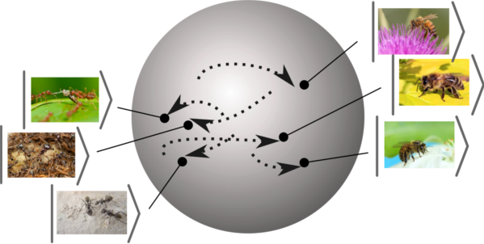
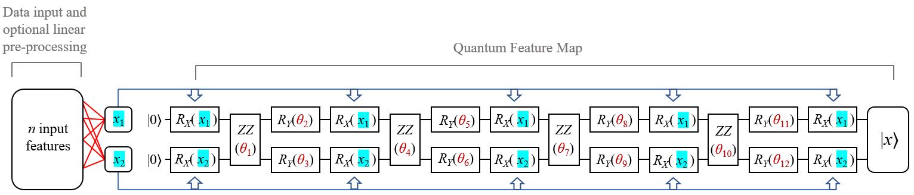
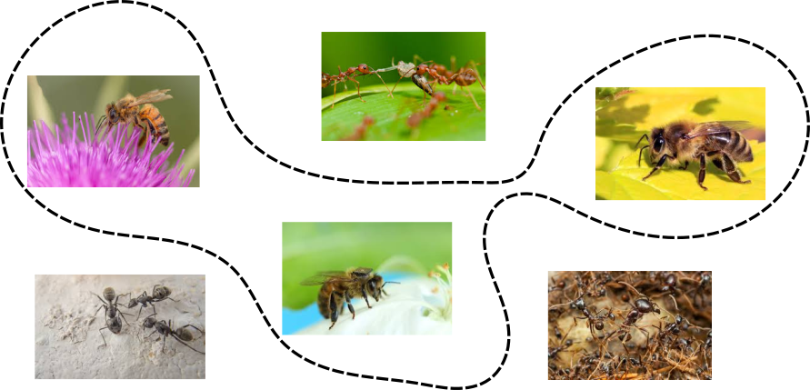
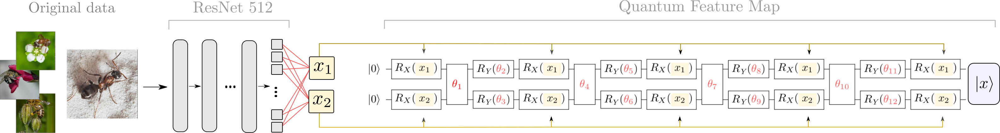
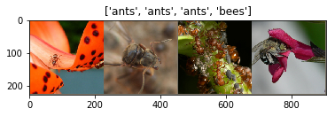
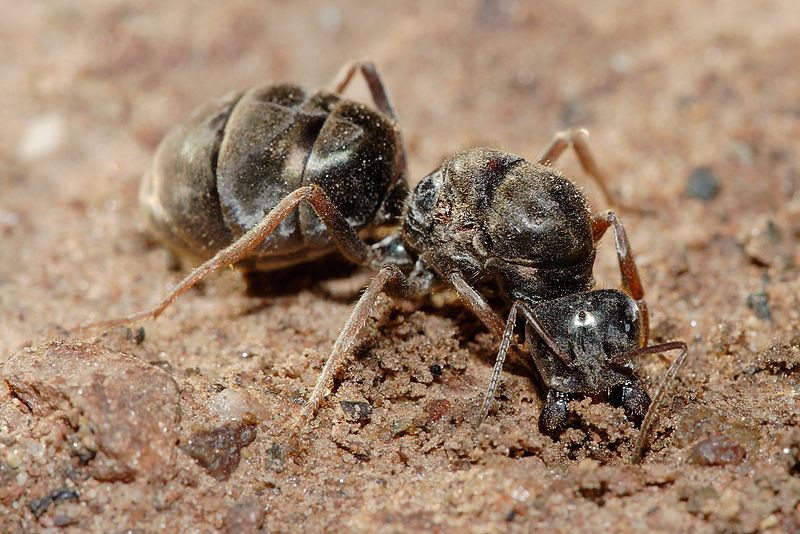

.. note::
    :class: sphx-glr-download-link-note

    Click :ref:`here <sphx_glr_download_demos_tutorial_embeddings_metric_learning.py>` to download the full example code
.. rst-class:: sphx-glr-example-title

.. _sphx_glr_demos_tutorial_embeddings_metric_learning.py:

Quantum embeddings and metric learning
======================================

**Authors: Maria Schuld and Aroosa Ijaz**

This tutorial illustrates the idea of quantum embeddings for metric
learning presented in `Lloyd, Schuld, Ijaz, Izaac, Killoran (2019) <https://arxiv.org/abs/2001.03622>`_,
by training a hybrid classical-quantum data
embedding to classify images of ants and bees. The example was inspired
by `Mari et al. (2019) <https://arxiv.org/abs/1912.08278>`_,
(see also this `tutorial <https://pennylane.ai/qml/demos/tutorial_quantum_transfer_learning.html>`_),
and reproduces some of the subplots in Figure 5 of Lloyd et al.

The tutorial requires the following imports:

.. code-block:: default

    # %matplotlib inline
    import matplotlib.pyplot as plt
    from mpl_toolkits.axes_grid1 import make_axes_locatable

    import pennylane as qml
    from pennylane import numpy as np
    from pennylane import RX, RY, RZ, CNOT

Idea
----

Quantum metric learning trains a quantum embedding—for example, a
quantum circuit that encodes classical data into quantum states—to
separate different classes of data in the Hilbert space of the quantum
system.

The trained embedding can be used for classification. A new data sample
(red dot) gets mapped into Hilbert space via the same embedding, and a
special measurement compares it to the two embedded classes.
The decision boundary of the measurement in quantum state space is nearly
linear (red dashed line).

Since a simple metric in Hilbert space corresponds to a potentially much
more complex metric in the original data space, the simple decision
boundary can translate to a non-trivial decision boundary in the
original space of the data.

The best quantum measurement one could construct to classify new inputs
depends on the loss defined for the classification task, as well as the
metric used to optimize the separation of data.

For a linear cost function, data separated by the trace distance or
:math:`\ell_1` metric is best distinguished by a Helstrom measurement, while
data separated by the Hilbert-Schmidt distance or :math:`\ell_2` metric
is best classified by a fidelity measurement. Here we show how to
implement training and classification based on the :math:`\ell_2`
metric.

Embedding
---------

A quantum embedding is a representation of data points :math:`x` from a
data domain :math:`X` as a *(quantum) feature state*
:math:`| x \rangle`. Either the full embedding, or part of it, can be
facilitated by a "quantum feature map", a quantum circuit
:math:`\Phi(x)` that depends on the input. If the circuit has additional
parameters :math:`\theta` that are adaptable,
:math:`\Phi = \Phi(x, \theta)`, the quantum feature map can be trained
via optimization.

In this tutorial we investigate a trainable, hybrid classical-quantum embedding
implemented by a partially pre-trained classical neural network,
followed by a parametrized quantum circuit that implements the quantum
feature map:

|

|

Following `Mari et al. (2019) <https://arxiv.org/abs/1912.08278>`__,
for the classical neural network we use PyTorch's
``torch.models.resnet18()``, setting ``pretrained=True``. The final
layer of the ResNet, which usually maps a 512-dimensional vector to 1000
nodes representing different image classes, is replaced by a linear
layer of 2 output neurons. The classical part of the embedding therefore
maps the images to a 2-dimensional *intermediate feature space*.

For the quantum part we use the QAOA embedding proposed
in `Lloyd et al. (2019) <https://arxiv.org/abs/2001.03622>`_.
The feature map is represented by a layered variational circuit, which
alternates a "feature-encoding Hamiltonian" and an "Ising-like" Hamiltonian
with ZZ-entanglers (the two-qubit gates in the circuit diagram above) and ``RY`` gates as local fields.

.. code-block:: default

    def feature_encoding_hamiltonian(features, wires):

        for idx, w in enumerate(wires):
            RX(features[idx], wires=w)

    def ising_hamiltonian(weights, wires, l):

            # ZZ coupling
            CNOT(wires=wires)
            RZ(2 * weights[l, 0], wires=wires[0])
            CNOT(wires=wires)
            # local fields
            for w in wires:
                RY(weights[l, i + 1], wires=w)

    def QAOAEmbedding(features, weights, wires):

        repeat = len(weights)
        for l in range(repeat):
            # apply alternating Hamiltonians
            feature_encoding_hamiltonian(features, wires)
            ising_hamiltonian(weights, wires, l)
        # repeat the feature encoding once more at the end
        feature_encoding_hamiltonian(features, wires)

Overall, the embedding has 1024 + 12 trainable parameters - 1024 for the
classical part of the model and 12 for the four layers of the QAOA
embedding.

.. note:: The pretrained neural network has already learned
          to separate the data. The example does therefore not
          make any claims on the performance of the embedding, but aims to
          illustrate how a hybrid embedding can be trained.

Data
----

We consider a binary supervised learning problem with examples
:math:`\{a_1,...a_{M_a}\} \subseteq X` from class :math:`A` and examples
:math:`\{b_1,...b_{M_b}\} \subseteq X` from class :math:`B`. The data
are images of ants (:math:`A`) and bees (:math:`B`), taken from `Kaggle's
hymenoptera dataset <https://www.kaggle.com/ajayrana/hymenoptera-data>`__.
This is a sample of four images:

For convenience, instead of coding up the classical neural network, we
load `pre-extracted feature vectors of the images
<https://github.com/XanaduAI/qml/blob/master/implementations/embedding_metric_learning/X_antbees.txt>`_.
These were created by
resizing, cropping and normalizing the images, and passing them through
PyTorch's pretrained ResNet 512 (that is, without the final linear
layer).

.. code-block:: default

    X = np.loadtxt("embedding_metric_learning/X_antbees.txt", ndmin=2)  #1  pre-extracted inputs
    Y = np.loadtxt("embedding_metric_learning/Y_antbees.txt")  # labels
    X_val = np.loadtxt(
        "embedding_metric_learning/X_antbees_test.txt", ndmin=2
    )  # pre-extracted validation inputs
    Y_val = np.loadtxt("embedding_metric_learning/Y_antbees_test.txt")  # validation labels

    # split data into two classes
    A = X[Y == -1]
    B = X[Y == 1]
    A_val = X_val[Y_val == -1]
    B_val = X_val[Y_val == 1]

    print(A.shape)
    print(B.shape)

.. rst-class:: sphx-glr-script-out

 Out:

 .. code-block:: none

    (83, 512)
    (70, 512)

Cost
----

The distance metric underlying the notion of 'separation' is the
:math:`\ell_2` or Hilbert-Schmidt norm, which depends on overlaps of
the embedded data points :math:`|a\rangle`
from class :math:`A` and :math:`|b\rangle` from class :math:`B`,

.. math::

    D_{\mathrm{hs}}(A, B) =  \frac{1}{2} \big( \sum_{i, i'} |\langle a_i|a_{i'}\rangle|^2
       +  \sum_{j,j'} |\langle b_j|b_{j'}\rangle|^2 \big)
       - \sum_{i,j} |\langle a_i|b_j\rangle|^2.

To maximize the :math:`\ell_2` distance between the two classes in
Hilbert space, we minimize the cost
:math:`C = 1 - \frac{1}{2}D_{\mathrm{hs}}(A, B)`.

To set up the "quantum part" of the cost function in PennyLane, we have
to create a quantum node. Here, the quantum node is simulated on
PennyLane's ``'default.qubit'`` backend.

.. note:: One could also connect the
          quantum node to a hardware backend to find out if the noise of a
          physical implementation still allows us to train the embedding.

.. code-block:: default

    n_features = 2
    n_qubits = 2 * n_features + 1

    dev = qml.device("default.qubit", wires=n_qubits)

We use a SWAP test to measure the overlap
:math:`|\langle \psi | \phi \rangle|^2` between two quantum feature
states :math:`|\psi\rangle` and :math:`|\phi\rangle`, prepared by a
``QAOAEmbedding`` with weights ``q_weights``.

.. code-block:: default

    @qml.qnode(dev)
    def swap_test(q_weights, x1, x2):

        # load the two inputs into two different registers
        QAOAEmbedding(features=x1, weights=q_weights, wires=[1, 2])
        QAOAEmbedding(features=x2, weights=q_weights, wires=[3, 4])

        # perform the SWAP test
        qml.Hadamard(wires=0)
        for k in range(n_features):
            qml.CSWAP(wires=[0, k + 1, 2 + k + 1])
        qml.Hadamard(wires=0)

        return qml.expval(qml.PauliZ(0))

Before executing the swap test, the feature vectors have to be
multiplied by a (2, 512)-dimensional matrix that represents the weights
of the linear layer. This trainable classical pre-processing is executed
before calling the swap test:

.. code-block:: default

    def overlaps(weights, X1=None, X2=None):

        linear_layer = weights[0]
        q_weights = weights[1]

        overlap = 0
        for x1 in X1:
            for x2 in X2:
                # multiply the inputs with the linear layer weight matrix
                w_x1 = linear_layer @ x1
                w_x2 = linear_layer @ x2
                # overlap of embedded intermediate features
                overlap += swap_test(q_weights, w_x1, w_x2)

        mean_overlap = overlap / (len(X1) * len(X2))
        return mean_overlap

In the ``overlaps()`` function, ``weights`` is a list of two arrays, the first
representing the matrix of the linear layer, and the second containing
the quantum circuit parameters.

With this we can define the cost function :math:`C`, which depends on
inter- and intra-cluster overlaps.

.. code-block:: default

    def cost(weights, A=None, B=None):

        aa = overlaps(weights, X1=A, X2=A)
        bb = overlaps(weights, X1=B, X2=B)
        ab = overlaps(weights, X1=A, X2=B)

        d_hs = -2 * ab + (aa + bb)

        return 1 - 0.5 * d_hs

Optimization
------------
The initial parameters for the trainable classical and quantum part of the embedding are
chosen at random. The number of layers in the quantum circuit is derived from the first
dimension of `init_pars_quantum`.

.. code-block:: default

    # generate initial parameters for circuit
    init_pars_quantum = np.random.normal(loc=0, scale=0.1, size=(4, 3))

    # generate initial parameters for linear layer
    init_pars_classical = np.random.normal(loc=0, scale=0.1, size=(2, 512))

    init_pars = [init_pars_classical, init_pars_quantum]

We can now train the embedding with an ``RMSPropOptimizer``, sampling
five training points from each class in every step, here shown for 2 steps.

.. code-block:: default

    optimizer = qml.RMSPropOptimizer(stepsize=0.01)
    batch_size = 5
    pars = init_pars

    for i in range(2):

        # Sample a batch of training inputs from each class
        selectA = np.random.choice(range(len(A)), size=(batch_size,), replace=True)
        selectB = np.random.choice(range(len(B)), size=(batch_size,), replace=True)
        A_batch = [A[s] for s in selectA]
        B_batch = [B[s] for s in selectB]

        # Walk one optimization step
        pars = optimizer.step(lambda w: cost(w, A=A_batch, B=B_batch), pars)
        print("Step", i, "done.")

        # Print the validation cost every 10 steps
        if i % 5 == 0 and i != 0:
            cst = cost(pars, A=A_val, B=B_val)
            print("Cost on validation set {:2f}".format(cst))

.. rst-class:: sphx-glr-script-out

 Out:

 .. code-block:: none

    Step 0 done.
    Step 1 done.

Optimizing a hybrid quantum-classical model with 1024 + 12 parameters
takes an awfully long time. We will
therefore load a set of `already trained parameters
<https://github.com/XanaduAI/qml/blob/master/implementations/embedding_metric_learning/pretrained_parameters.npy>`_
(from running the cell above for 1500 steps).

.. note:: Training is sensitive to the hyperparameters
such as the batch size, initial parameters and
optimizer used.

.. code-block:: default

    pretrained_pars = np.load("embedding_metric_learning/pretrained_parameters.npy",
                              allow_pickle=True)

    print(pretrained_pars)

.. rst-class:: sphx-glr-script-out

 Out:

 .. code-block:: none

    [array([[ 0.07892546,  0.18963997,  0.01267011, ..., -0.41917757,
             0.13794201, -0.31620719],
           [-0.49709026, -0.49160803, -0.16817771, ...,  0.35410417,
            -0.28687695,  0.25804757]])
     array([[ 1.28247918e-03, -2.53456415e-05, -2.53456415e-05],
           [ 1.55648560e-06,  1.65446338e-02,  1.55648553e-06],
           [ 8.12333186e-06, -1.99865981e-04,  6.71177010e-03],
           [-2.92851167e-03,  8.12333185e-06,  1.09834400e-03]])]

Analysis
--------

Let us analyze the effect of training. To speed up the script, we will
only look at a reduced version of the training and validation set,
selecting the first 10 points from either class.

.. code-block:: default

    select = 10

First of all, the final cost with the pre-trained parameters is as
follows:

.. code-block:: default

    cost_train = cost(pretrained_pars, A=A[:select], B=B[:select])
    cost_val = cost(pretrained_pars, A=A_val[:select], B=B_val[:select])
    print("Cost for pretrained parameters on training set:", cost_train)
    print("Cost for pretrained parameters on validation set:", cost_val)

.. rst-class:: sphx-glr-script-out

 Out:

 .. code-block:: none

    Cost for pretrained parameters on training set: 1.853538574958513e-05
    Cost for pretrained parameters on validation set: 1.853538574958513e-05

A useful way to visualize the distance of data points is to plot a Gram
matrix of the overlaps of different feature states. For this we join the
first 10 examples of each of the two classes.

.. code-block:: default

    A_B = np.r_[A[:select], B[:select]]

Before training, the separation between the classes is not recognizable
in the Gram matrix:

.. code-block:: default

    gram_before = [[overlaps(init_pars, X1=[x1], X2=[x2]) for x1 in A_B] for x2 in A_B]

    ax = plt.subplot(111)
    im = ax.matshow(gram_before, vmin=0, vmax=1)
    divider = make_axes_locatable(ax)
    cax = divider.append_axes("right", size="5%", pad=0.05)
    plt.colorbar(im, cax=cax)
    plt.show()

.. image:: /demos/images/sphx_glr_tutorial_embeddings_metric_learning_001.png
    :class: sphx-glr-single-img

After training, the gram matrix clearly separates the two classes.

.. code-block:: default

    gram_after = [[overlaps(pretrained_pars, X1=[x1], X2=[x2]) for x1 in A_B] for x2 in A_B]

    ax = plt.subplot(111)
    im = ax.matshow(gram_after, vmin=0, vmax=1)
    divider = make_axes_locatable(ax)
    cax = divider.append_axes("right", size="5%", pad=0.05)
    plt.colorbar(im, cax=cax)
    plt.show()

.. image:: /demos/images/sphx_glr_tutorial_embeddings_metric_learning_002.png
    :class: sphx-glr-single-img

We can also visualize the "intermediate layer" of 2-dimensional vectors
:math:`(x_1, x_2)`, just before feeding them into the quantum circuit.
Before training the (2, 512)-dimensional weight matrix of the linear
layer, the classes are arbitrarily intermixed.

.. code-block:: default

    for a in A:
        intermediate_a = init_pars[0] @ a
        plt.scatter(intermediate_a[:][0], intermediate_a[:][1], c="red")

    for b in B:
        intermediate_b = init_pars[0] @ b
        plt.scatter(intermediate_b[:][0], intermediate_b[:][1], c="blue")

.. image:: /demos/images/sphx_glr_tutorial_embeddings_metric_learning_003.png
    :class: sphx-glr-single-img

However, after training, the linear layer learned to arrange the
intermediate feature vectors on a periodic grid.

.. code-block:: default

    for a in A:
        intermediate_a = pretrained_pars[0] @ a
        plt.scatter(intermediate_a[:][0], intermediate_a[:][1], c="red")

    for b in B:
        intermediate_b = pretrained_pars[0] @ b
        plt.scatter(intermediate_b[:][0], intermediate_b[:][1], c="blue")

.. image:: /demos/images/sphx_glr_tutorial_embeddings_metric_learning_004.png
    :class: sphx-glr-single-img

Classification
--------------

Given a new input :math:`x \in X`, and its quantum feature state
:math:`|x \rangle`, the trained embedding can be used to solve the
binary classification problem of assigning :math:`x` to either :math:`A`
or :math:`B`. For an embedding separating data via the :math:`\ell_2`
metric, a very simple measurement can be used for classification: one
computes the overlap of :math:`|x \rangle` with examples of
:math:`|a \rangle` and :math:`|b \rangle`. :math:`x` is assigned to the
class with which it has a larger average overlap in the space of the
embedding.

Let us consider a picture of an ant from the validation set (assuming
our model never saw it during training):

|

|

After passing it through the classical neural network (excluding the final
linear layer), the 512-dimensional feature vector is given by
``A_val[0]``.

.. code-block:: default

    x_new = A_val[0]

    print(x_new.shape)

.. rst-class:: sphx-glr-script-out

 Out:

 .. code-block:: none

    (512,)

We compare the new input with randomly selected samples. The more
samples used, the smaller the variance in the prediction.

.. code-block:: default

    n_samples = 200

    prediction = 0
    for s in range(n_samples):

        # select a random sample from the training set
        sample_index = np.random.choice(len(X))
        x = X[sample_index]
        y = Y[sample_index]

        # compute the overlap between training sample and new input
        overlap = overlaps(pretrained_pars, X1=[x], X2=[x_new])

        # add the label weighed by the overlap to the prediction
        prediction += y * overlap

    # normalize prediction
    prediction = prediction / n_samples
    print(prediction)

.. rst-class:: sphx-glr-script-out

 Out:

 .. code-block:: none

    -0.5399898025031251

Since the result is negative, the new data point is (correctly) predicted
to be a picture of an ant, which was the class with -1 labels.

References
----------
Seth Lloyd, Maria Schuld, Aroosa Ijaz, Josh Izaac, Nathan Killoran: "Quantum embeddings for machine learning"
arXiv preprint arXiv:2001.03622.

Andrea Mari, Thomas R. Bromley, Josh Izaac, Maria Schuld, Nathan Killoran: "Transfer learning
in hybrid classical-quantum neural networks" arXiv preprint arXiv:1912.08278

.. rst-class:: sphx-glr-timing

   **Total running time of the script:** ( 1 minutes  24.068 seconds)

.. _sphx_glr_download_demos_tutorial_embeddings_metric_learning.py:

.. only :: html

 .. container:: sphx-glr-footer
    :class: sphx-glr-footer-example

  .. container:: sphx-glr-download

     :download:`Download Python source code: tutorial_embeddings_metric_learning.py <tutorial_embeddings_metric_learning.py>`

  .. container:: sphx-glr-download

     :download:`Download Jupyter notebook: tutorial_embeddings_metric_learning.ipynb <tutorial_embeddings_metric_learning.ipynb>`

.. only:: html

 .. rst-class:: sphx-glr-signature

    `Gallery generated by Sphinx-Gallery <https://sphinx-gallery.readthedocs.io>`_
