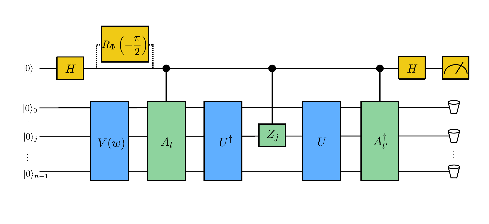

.. note::
    :class: sphx-glr-download-link-note

    Click :ref:`here <sphx_glr_download_demos_tutorial_vqls.py>` to download the full example code
.. rst-class:: sphx-glr-example-title

.. _sphx_glr_demos_tutorial_vqls.py:

.. _vqls:

Variational Quantum Linear Solver
====================================
*Author: Andrea Mari*

In this tutorial we implement a quantum algorithm known as the *variational quantum linear
solver* (VQLS), originally introduced in
`Bravo-Prieto et al. (2019) <https://arxiv.org/abs/1909.05820>`_.

Introduction
------------

We first define the problem and the general structure of a VQLS.
As a second step, we consider a particular case and we solve it explicitly with PennyLane.

The problem
^^^^^^^^^^^

We are given a :math:`2^n \times 2^n` matrix :math:`A` which can be expressed as a linear
combination of :math:`L` unitary matrices :math:`A_0, A_1, \dots A_{L-1}`, i.e.,

.. math::

    A = \sum_{l=0}^{L-1} c_l A_l,

where :math:`c_l` are arbitrary complex numbers. Importantly, we assume that each of the
unitary components :math:`A_l` can be efficiently implemented with a quantum circuit
acting on :math:`n` qubits.

We are also given a normalized complex vector in the physical form of a quantum
state :math:`|b\rangle`, which can be generated by a unitary operation :math:`U`
applied to the ground state of :math:`n` qubits. , i.e.,

.. math::

    |b\rangle = U |0\rangle,

where again we assume that :math:`U` can be efficiently implemented with a quantum circuit.

The problem that we aim to solve is that of preparing a quantum state :math:`|x\rangle`, such that
:math:`A |x\rangle` is proportional to :math:`|b\rangle` or, equivalently, such that

.. math::

    |\Psi\rangle :=  \frac{A |x\rangle}{\sqrt{\langle x |A^\dagger A |x\rangle}} \approx |b\rangle.

Variational quantum linear solver
^^^^^^^^^^^^^^^^^^^^^^^^^^^^^^^^^

The approach used in a VQLS is to approximate the solution :math:`|x\rangle` with a variational quantum
circuit, i.e., a unitary circuit :math:`V` depending on a finite number of classical real parameters
:math:`w = (w_0, w_1, \dots)`:

.. math::

    |x \rangle = V(w) |0\rangle.

The parameters should be optimized in order to maximize the overlap between the quantum states
:math:`|\Psi\rangle` and :math:`|b\rangle`. This suggests to define the following cost function:

.. math::

    C_G = 1- |\langle b | \Psi \rangle|^2,

such that its minimization with respect to the variational parameters should lead towards the problem solution.

Now we discuss two alternative methods which could be used to experimentally solve the minimization problem.

First method
>>>>>>>>>>>>>

Let us write :math:`C_G` more explicitly:

.. math::

    C_G = 1- \frac{ \sum_{l, l'}  c_l c_{l'}^* \langle 0|  V^\dagger A_{l'}^\dagger U \color{blue}{|0\rangle \langle 0|} U^\dagger A_l  V |0\rangle}
    {\sum_{l,l'} c_l c_{l'}^* \langle 0| V^\dagger A_{l'}^\dagger A_l V |0\rangle} .

All expectation values of the previous expression could be estimated with a
`Hadamard test <https://en.wikipedia.org/wiki/Hadamard_test_(quantum_computation)>`_,
which is a standard quantum computation technique. This method however might be experimentally challenging since it requires us to apply
all the unitaries (:math:`U^\dagger, A_l` and :math:`V`) in a controlled way,
i.e., conditioned on the state of an ancillary qubit. A possible workaround for estimating the same expectation values in a simpler
way has been proposed in Ref. [1], but will not be considered here.

Second method
>>>>>>>>>>>>>

The second method, which is the one used in this tutorial, is to minimize a "local" version of the cost function which is easier to
measure and, at the same time, leads to the same optimal solution.
This local cost function, originally proposed in Ref. [1], can be obtained by replacing the blue-colored projector
:math:`\color{blue}{|0\rangle\langle 0|}` in the previous expression with the following positive operator:

.. math::

     \color{blue}{P} =  \frac{1}{2} + \frac{1}{2n}\sum_{j=0}^{n-1} Z_j,

where :math:`Z_j` is the Pauli :math:`Z` operator locally applied to the :math:`j\rm{th}` qubit. This gives a new cost function:

.. math::

    C_L = 1- \frac{ \sum_{l, l'}  c_l c_{l'}^* \langle 0|  V^\dagger A_{l'}^\dagger U \color{blue}{P} U^\dagger A_l  V |0\rangle}
    {\sum_{l,l'} c_l c_{l'}^* \langle 0| V^\dagger A_{l'}^\dagger A_l V |0\rangle},

which, as shown in Ref. [1], satisfies

.. math::

   C_G \rightarrow 0   \Leftrightarrow C_L \rightarrow 0,

and so we can solve our problem by minimizing :math:`C_L` instead of :math:`C_G`.

Substituting the definition of :math:`P` into the expression for :math:`C_L` we get:

.. math::

    C_L
    &=& \frac{1}{2} - \frac{1}{2n} \frac{ \sum_{j=0}^{n-1} \sum_{l, l'}  c_l c_{l'}^* \langle 0|  V^\dagger A_{l'}^\dagger U Z_j U^\dagger A_l  V |0\rangle}
    {\sum_{l,l'} c_l c_{l'}^* \langle 0| V^\dagger A_{l'}^\dagger A_l V |0\rangle} \\
    &&\\
    &=& \frac{1}{2} - \frac{1}{2n} \frac{ \sum_{j=0}^{n-1} \sum_{l, l'}  c_l c_{l'}^* \mu_{l,l',j}}
    {\sum_{l,l'} c_l c_{l'}^* \mu_{l,l',-1}},

which can be computed whenever we are able to measure the following coefficients

.. math::
    \mu_{l, l', j} = \langle 0|  V^\dagger A_{l'}^\dagger U Z_j U^\dagger A_l  V |0\rangle,

where we used the convention that if :math:`j=-1`,  :math:`Z_{-1}` is replaced with the identity.

Also in this case the complex coefficients :math:`\mu_{l, l', j}` can be experimentally measured with a Hadamard test.
The corresponding quantum circuit is shown in the image at the top of this tutorial.
Compared with the previous method, the main advantage of this approach is that only the unitary operations
:math:`A_l, A_l^\dagger` and :math:`Z_j` need to be controlled by an external ancillary qubit,
while :math:`V, V^\dagger, U` and :math:`U^\dagger` can be directly applied to the system.
This is particularly convenient whenever :math:`V` has a complex structure, e.g., if it is composed of
many variational layers.

A simple example
^^^^^^^^^^^^^^^^

In this tutorial we consider the following simple example based on a system of 3 qubits (plus an ancilla),
which is very similar to the one experimentally tested in Ref. [1]:

.. math::
        \begin{align}
        A  &=  c_0 A_0 + c_1 A_1 + c_2 A_2 = \mathbb{I} + 0.2 X_0 Z_1 + 0.2 X_0, \\
        \\
        |b\rangle &= U |0 \rangle = H_0  H_1  H_2 |0\rangle,
        \end{align}

where :math:`Z_j, X_j, H_j` represent the Pauli :math:`Z`, Pauli :math:`X` and Hadamard gates applied to the qubit with index :math:`j`.

This problem is computationally quite easy since a single layer of local rotations is enough to generate the
solution state, i.e., we can use the following simple ansatz:

.. math::
        |x\rangle = V(w) |0\rangle = \Big [  R_y(w_0) \otimes  R_y(w_1) \otimes  R_y(w_2) \Big ]  H_0  H_1  H_2 |0\rangle.

In the code presented below we solve this particular problem by minimizing the local cost function :math:`C_L`.
Eventually we will compare the quantum solution with the classical one.

General setup
------------------------
This Python code requires *PennyLane* and the plotting library *matplotlib*.

.. code-block:: default

    # Pennylane
    import pennylane as qml
    from pennylane import numpy as np

    # Plotting
    import matplotlib.pyplot as plt

Setting of the main hyper-parameters of the model
^^^^^^^^^^^^^^^^^^^^^^^^^^^^^^^^^^^^^^^^^^^^^^^^^

.. code-block:: default

    n_qubits = 3  # Number of system qubits.
    n_shots = 10 ** 6  # Number of quantum measurements.
    tot_qubits = n_qubits + 1  # Addition of an ancillary qubit.
    ancilla_idx = n_qubits  # Index of the ancillary qubit (last position).
    steps = 30  # Number of optimization steps
    eta = 0.8  # Learning rate
    q_delta = 0.001  # Initial spread of random quantum weights
    rng_seed = 0  # Seed for random number generator

Circuits of the quantum linear problem
^^^^^^^^^^^^^^^^^^^^^^^^^^^^^^^^^^^^^^

We now define the unitary operations associated to the simple example
presented in the introduction.
Since we want to implement a Hadamard test, we need the unitary operations
:math:`A_j` to be controlled by the state of an ancillary qubit.

.. code-block:: default

    # Coefficients of the linear combination A = c_0 A_0 + c_1 A_1 ...
    c = np.array([1.0, 0.2, 0.2])

    def U_b():
        """Unitary matrix rotating the ground state to the problem vector |b> = U_b |0>."""
        for idx in range(n_qubits):
            qml.Hadamard(wires=idx)

    def CA(idx):
        """Controlled versions of the unitary components A_l of the problem matrix A."""
        if idx == 0:
            # Identity operation
            None

        elif idx == 1:
            qml.CNOT(wires=[ancilla_idx, 0])
            qml.CZ(wires=[ancilla_idx, 1])

        elif idx == 2:
            qml.CNOT(wires=[ancilla_idx, 0])

Variational quantum circuit
^^^^^^^^^^^^^^^^^^^^^^^^^^^^^^^^^^^^^^

What follows is the variational quantum circuit that should generate the solution
state :math:`|x\rangle= V(w)|0\rangle`.

The first layer of the circuit is a product of Hadamard gates preparing a
balanced superposition of all basis states.

After that, we apply a very simple variational ansatz
which is just a single layer of qubit rotations
:math:`R_y(w_0) \otimes  R_y(w_1) \otimes  R_y(w_2)`.
For solving more complex problems, we suggest to use more expressive circuits as,
e.g., the PennyLane :func:`~.StronglyEntanglingLayers` template.

.. code-block:: default

    def variational_block(weights):
        """Variational circuit mapping the ground state |0> to the ansatz state |x>."""
        # We first prepare an equal superposition of all the states of the computational basis.
        for idx in range(n_qubits):
            qml.Hadamard(wires=idx)

        # A very minimal variational circuit.
        for idx, element in enumerate(weights):
            qml.RY(element, wires=idx)

Hadamard test
--------------

We first initialize a PennyLane device with the ``default.qubit`` backend.

As a second step, we define a PennyLane ``QNode`` representing a model of the actual quantum computation.

The circuit is based on the
`Hadamard test <https://en.wikipedia.org/wiki/Hadamard_test_(quantum_computation)>`_
and will be used to estimate the coefficients :math:`\mu_{l,l',j}` defined in the introduction.
A graphical representation of this circuit is shown at the top of this tutorial.

.. code-block:: default

    dev_mu = qml.device("default.qubit", wires=tot_qubits)

    @qml.qnode(dev_mu)
    def local_hadamard_test(weights, l=None, lp=None, j=None, part=None):

        # First Hadamard gate applied to the ancillary qubit.
        qml.Hadamard(wires=ancilla_idx)

        # For estimating the imaginary part of the coefficient "mu", we must add a "-i" phase gate.
        if part == "Im" or part == "im":
            qml.PhaseShift(-np.pi / 2, wires=ancilla_idx)

        # Variational circuit generating a guess for the solution vector |x>
        variational_block(weights)

        # Controlled application of the unitary component A_l of the problem matrix A.
        CA(l)

        # Adjoint of the unitary U_b associated to the problem vector |b>. 
        # In this specific example Adjoint(U_b) = U_b.
        U_b()

        # Controlled Z operator at position j. If j = -1, apply the identity.
        if j != -1:
            qml.CZ(wires=[ancilla_idx, j])

        # Unitary U_b associated to the problem vector |b>.
        U_b()

        # Controlled application of Adjoint(A_lp).
        # In this specific example Adjoint(A_lp) = A_lp.
        CA(lp)

        # Second Hadamard gate applied to the ancillary qubit.
        qml.Hadamard(wires=ancilla_idx)

        # Expectation value of Z for the ancillary qubit.
        return qml.expval(qml.PauliZ(wires=ancilla_idx))

To get the real and imaginary parts of :math:`\mu_{l,l',j}`, one needs to run the previous
quantum circuit with and without a phase-shift of the ancillary qubit. This is automatically
done by the following function.

.. code-block:: default

    def mu(weights, l=None, lp=None, j=None):
        """Generates the coefficients to compute the "local" cost function C_L."""

        mu_real = local_hadamard_test(weights, l=l, lp=lp, j=j, part="Re")
        mu_imag = local_hadamard_test(weights, l=l, lp=lp, j=j, part="Im")

        return mu_real + 1.0j * mu_imag

Local cost function
------------------------------------

Let us first define a function for estimating :math:`\langle x| A^\dagger A|x\rangle`.

.. code-block:: default

    def psi_norm(weights):
        """Returns the normalization constant <psi|psi>, where |psi> = A |x>."""
        norm = 0.0

        for l in range(0, len(c)):
            for lp in range(0, len(c)):
                norm = norm + c[l] * np.conj(c[lp]) * mu(weights, l, lp, -1)

        return abs(norm)

We can finally define the cost function of our minimization problem.
We use the analytical expression of :math:`C_L` in terms of the
coefficients :math:`\mu_{l,l',j}` given in the introduction.

.. code-block:: default

    def cost_loc(weights):
        """Local version of the cost function, which tends to zero when A |x> is proportional to |b>."""
        mu_sum = 0.0

        for l in range(0, len(c)):
            for lp in range(0, len(c)):
                for j in range(0, n_qubits):
                    mu_sum = mu_sum + c[l] * np.conj(c[lp]) * mu(weights, l, lp, j)

        mu_sum = abs(mu_sum)

        # Cost function C_L
        return 0.5 - 0.5 * mu_sum / (n_qubits * psi_norm(weights))

Variational optimization
-----------------------------

We first initialize the variational weights with random parameters (with a fixed seed).

.. code-block:: default

    np.random.seed(rng_seed)
    w = q_delta * np.random.randn(n_qubits)

To minimize the cost function we use the gradient-descent optimizer.

.. code-block:: default

    opt = qml.GradientDescentOptimizer(eta)

We are ready to perform the optimization loop.

.. code-block:: default

    cost_history = []
    for it in range(steps):
        w = opt.step(cost_loc, w)
        cost = cost_loc(w)
        print("Step {:3d}       Cost_L = {:9.7f}".format(it, cost))
        cost_history.append(cost)

.. rst-class:: sphx-glr-script-out

 Out:

 .. code-block:: none

    Step   0       Cost_L = 0.0070072
    Step   1       Cost_L = 0.0054157
    Step   2       Cost_L = 0.0041528
    Step   3       Cost_L = 0.0031617
    Step   4       Cost_L = 0.0023917
    Step   5       Cost_L = 0.0017988
    Step   6       Cost_L = 0.0013461
    Step   7       Cost_L = 0.0010028
    Step   8       Cost_L = 0.0007442
    Step   9       Cost_L = 0.0005503
    Step  10       Cost_L = 0.0004058
    Step  11       Cost_L = 0.0002984
    Step  12       Cost_L = 0.0002190
    Step  13       Cost_L = 0.0001604
    Step  14       Cost_L = 0.0001173
    Step  15       Cost_L = 0.0000857
    Step  16       Cost_L = 0.0000625
    Step  17       Cost_L = 0.0000455
    Step  18       Cost_L = 0.0000331
    Step  19       Cost_L = 0.0000241
    Step  20       Cost_L = 0.0000175
    Step  21       Cost_L = 0.0000127
    Step  22       Cost_L = 0.0000092
    Step  23       Cost_L = 0.0000067
    Step  24       Cost_L = 0.0000049
    Step  25       Cost_L = 0.0000035
    Step  26       Cost_L = 0.0000026
    Step  27       Cost_L = 0.0000019
    Step  28       Cost_L = 0.0000013
    Step  29       Cost_L = 0.0000010

We plot the cost function with respect to the optimization steps.
We remark that this is not an abstract mathematical quantity
since it also represents a bound for the error between the generated state
and the exact solution of the problem.

.. code-block:: default

    plt.style.use("seaborn")
    plt.plot(cost_history, "g")
    plt.ylabel("Cost function")
    plt.xlabel("Optimization steps")
    plt.show()

.. image:: /demos/images/sphx_glr_tutorial_vqls_001.png
    :class: sphx-glr-single-img

Comparison of quantum and classical results
-------------------------------------------

Since the specific problem considered in this tutorial has a small size, we can also
solve it in a classical way and then compare the results with our quantum solution.

Classical algorithm
^^^^^^^^^^^^^^^^^^^
To solve the problem in a classical way, we use the explicit matrix representation in
terms of numerical NumPy arrays.

.. code-block:: default

 
    Id = np.identity(2)
    Z = np.array([[1, 0], [0, -1]])
    X = np.array([[0, 1], [1, 0]])

    A_0 = np.identity(8)
    A_1 = np.kron(np.kron(X, Z), Id)
    A_2 = np.kron(np.kron(X, Id), Id)

    A_num = c[0] * A_0 + c[1] * A_1 + c[2] * A_2
    b = np.ones(8) / np.sqrt(8)

We can print the explicit values of :math:`A` and :math:`b`:

.. code-block:: default

    print("A = \n", A_num)
    print("b = \n", b)

.. rst-class:: sphx-glr-script-out

 Out:

 .. code-block:: none

    A = 
     [[1.  0.  0.  0.  0.4 0.  0.  0. ]
     [0.  1.  0.  0.  0.  0.4 0.  0. ]
     [0.  0.  1.  0.  0.  0.  0.  0. ]
     [0.  0.  0.  1.  0.  0.  0.  0. ]
     [0.4 0.  0.  0.  1.  0.  0.  0. ]
     [0.  0.4 0.  0.  0.  1.  0.  0. ]
     [0.  0.  0.  0.  0.  0.  1.  0. ]
     [0.  0.  0.  0.  0.  0.  0.  1. ]]
    b = 
     [0.35355339 0.35355339 0.35355339 0.35355339 0.35355339 0.35355339
     0.35355339 0.35355339]

The solution can be computed via a matrix inversion:

.. code-block:: default

    A_inv = np.linalg.inv(A_num)
    x = np.dot(A_inv, b)

Finally, in order to compare x with the quantum state :math:`|x\rangle`, we normalize
and square its elements.

.. code-block:: default

    c_probs = (x / np.linalg.norm(x)) ** 2

Preparation of the quantum solution
^^^^^^^^^^^^^^^^^^^^^^^^^^^^^^^^^^^

Given the variational weights ``w`` that we have previously optimized,
we can generate the quantum state :math:`|x\rangle`. By measuring :math:`|x\rangle`
in the computational basis we can estimate the probability of each basis state.

For this task, we initialize a new PennyLane device and define the associated
*qnode* circuit.

.. code-block:: default

    dev_x = qml.device("default.qubit", wires=n_qubits, shots=n_shots)

    @qml.qnode(dev_x)
    def prepare_and_sample(weights):

        # Variational circuit generating a guess for the solution vector |x>
        variational_block(weights)

        # We assume that the system is measured in the computational basis.
        # If we label each basis state with a decimal integer j = 0, 1, ... 2 ** n_qubits - 1,
        # this is equivalent to a measurement of the following diagonal observable.
        basis_obs = qml.Hermitian(np.diag(range(2 ** n_qubits)), wires=range(n_qubits))

        return qml.sample(basis_obs)

To estimate the probability distribution over the basis states we first take ``n_shots``
samples and then compute the relative frequency of each outcome.

.. code-block:: default

    samples = prepare_and_sample(w).astype(int)
    q_probs = np.bincount(samples) / n_shots

Comparison
^^^^^^^^^^

Let us print the classical result.

.. code-block:: default

    print("x_n^2 =\n", c_probs)

.. rst-class:: sphx-glr-script-out

 Out:

 .. code-block:: none

    x_n^2 =
     [0.08445946 0.08445946 0.16554054 0.16554054 0.08445946 0.08445946
     0.16554054 0.16554054]

The previous probabilities should match the following quantum state probabilities.

.. code-block:: default

    print("|<x|n>|^2=\n", q_probs)

.. rst-class:: sphx-glr-script-out

 Out:

 .. code-block:: none

    |<x|n>|^2=
     [0.084589 0.085022 0.164642 0.164879 0.085241 0.084731 0.165431 0.165465]

Let us graphically visualize both distributions.

.. code-block:: default

    fig, (ax1, ax2) = plt.subplots(1, 2, figsize=(7, 4))

    ax1.bar(np.arange(0, 2 ** n_qubits), c_probs, color="blue")
    ax1.set_xlim(-0.5, 2 ** n_qubits - 0.5)
    ax1.set_xlabel("Vector space basis")
    ax1.set_title("Classical probabilities")

    ax2.bar(np.arange(0, 2 ** n_qubits), q_probs, color="green")
    ax2.set_xlim(-0.5, 2 ** n_qubits - 0.5)
    ax2.set_xlabel("Hilbert space basis")
    ax2.set_title("Quantum probabilities")

    plt.show()

.. image:: /demos/images/sphx_glr_tutorial_vqls_002.png
    :class: sphx-glr-single-img

References
----------

1. Carlos Bravo-Prieto, Ryan LaRose, Marco Cerezo, Yigit Subasi, Lukasz Cincio, Patrick J. Coles.
   "Variational Quantum Linear Solver: A Hybrid Algorithm for Linear Systems."
   `arXiv:1909.05820 <https://arxiv.org/abs/1909.05820>`__, 2019.

.. rst-class:: sphx-glr-timing

   **Total running time of the script:** ( 0 minutes  26.567 seconds)

.. _sphx_glr_download_demos_tutorial_vqls.py:

.. only :: html

 .. container:: sphx-glr-footer
    :class: sphx-glr-footer-example

  .. container:: sphx-glr-download

     :download:`Download Python source code: tutorial_vqls.py <tutorial_vqls.py>`

  .. container:: sphx-glr-download

     :download:`Download Jupyter notebook: tutorial_vqls.ipynb <tutorial_vqls.ipynb>`

.. only:: html

 .. rst-class:: sphx-glr-signature

    `Gallery generated by Sphinx-Gallery <https://sphinx-gallery.readthedocs.io>`_
