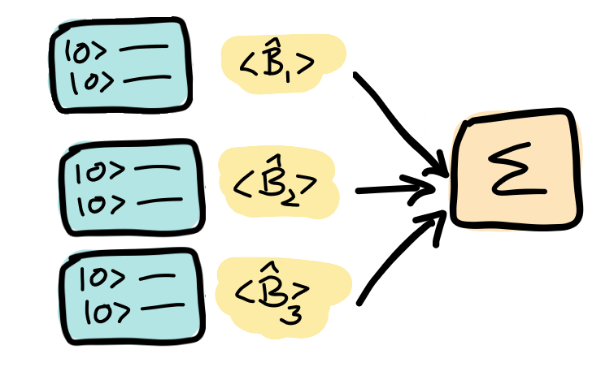
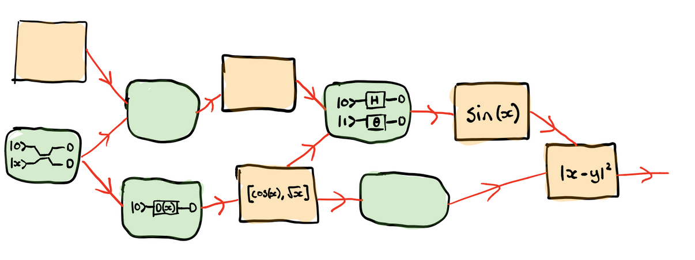

.. role:: html(raw)
   :format: html

.. _glossary_hybrid_computation:

Hybrid computation
==================

In the context of quantum computing, the term *hybrid* refers to the strategy of mixing classical and quantum
computations. This lies at the heart of optimizing :doc:`variational circuits </glossary/variational_circuit>`,
where a quantum algorithm is optimized with the help of a classical co-processor.

Typically, quantum devices used to estimate averages of measurement results (i.e., *expectations
of quantum observables*), which are combined in a single classical cost function that determines how "good"
the quantum circuits are. For example, in *variational quantum eigensolvers*
(`Peruzzo et al. (2013) <https://arxiv.org/abs/1304.3061>`_), the results of
some quantum expectations :math:`\langle \hat{B}_i \rangle` are summed up.

:html:` `

:html:` `

Directed acyclic graphs
-----------------------

It is easy to imagine more interesting ways we could combine quantum and classical ingredients into a larger
and more complex hybrid computation. In general, one can understand these subroutines as *classical* and
*quantum nodes*.

:html:` `

:html:` `

Quantum and classical nodes can be combined into an
arbitrary `directed acyclic graph <https://en.wikipedia.org/wiki/Directed_acyclic_graph>`_ (DAG).
This means that information flows from each node to its successors, and no cycles (loops) are created.
Other than these basic rules, any configuration is supported. Each node in the graph can be either
classical or quantum, and quantum nodes running on different devices (e.g., a qubit and a CV device)
can be combined in the same computation.

This DAG structure is similar to that appearing in modern deep learning models.

Backpropagation through hybrid computations
-------------------------------------------

Since we can estimate the :ref:`gradients <glossary_quantum_gradient>` of variational quantum circuits, hybrid
computations are compatible with techniques like the
famous `backpropagation <https://en.wikipedia.org/wiki/Backpropagation>`_
algorithm (also known as *reverse-mode automatic differentiation*), the workhorse algorithm for
training deep learning models.

This means that **we can differentiate end-to-end through hybrid quantum-classical computations**.
Quantum machine learning models can thus be trained in basically the same way as classical deep learning models.

.. note::
    The ability to backpropagate through hybrid computations does not mean that one can backpropagate (i.e.,
    compute errors) *through a quantum computation*. The quantum node is more considered as a black box whose
    gradient is known to the backpropagation algorithm.

.. seealso:: PennyLane effectively implements differentiable hybrid computations, and offers interfaces
    with NumPy (powered by the Autograd_ library), Pytorch_, Tensorflow_.

.. _Autograd: https://github.com/HIPS/autograd
.. _Tensorflow: http://tensorflow.org/
.. _Pytorch: https://pytorch.org/
