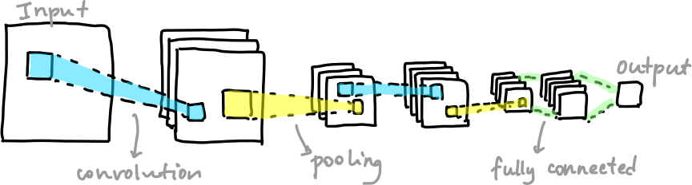
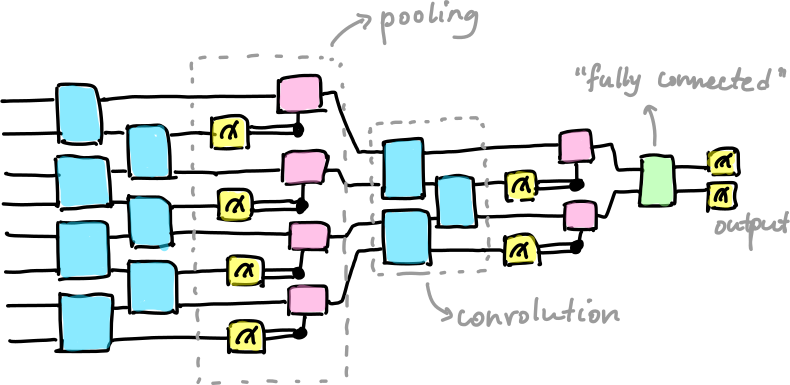

.. role:: html(raw)
   :format: html

.. _glossary_qcnn:

Quantum convolutional neural networks
=====================================

In classical machine learning, `convolutional neural networks
<https://en.wikipedia.org/wiki/Convolutional_neural_network>`_ (CNNs) are a type
of machine learning model often used in computer vision and image processing
applications. The structure of CNNs consists of applying alternating *convolutional
layers* (plus an activation function) and *pooling layers* to an input array,
typically followed by some fully connected layers before the output.

:html:` `

:html:` `

Convolutional layers consist of sweeping across the input array and applying
different filters (often 2x2 or 3x3 matrices) block by block. These are used to
detect specific features of the image wherever they might appear. Pooling layers
are then used to down sample the results of these convolutions to extract the
most relevant features and reduce the size of the data, making it easier to
process in subsequent layers. Common pooling methods involve replacing blocks of
the data with their maximum or average values.
      
Quantum convolutional neural networks (QCNNs) were first introduced in `Cong et
al. (2018) <https://arxiv.org/abs/1810.03787>`_. The structure of QCNNs is
motivated by that of CNNs:

:html:` `

:html:` `

Here, convolutions are operations performed on neighbouring pairs of qubits ---
they are parameterized unitary rotations, just like a regular :doc:`variational
circuit </glossary/variational_circuit>`! These convolutions are followed by
pooling layers, which are effected by measuring a subset of the qubits, and
using the measurement results to control subsequent operations. The analog of a
fully-connected layer is a multi-qubit operation on the remaining qubits before
the final measurement. Parameters of all these operations are learned during
training.

One very natural application of QCNNs is classifying quantum states - for
example, the `original work <https://arxiv.org/abs/1810.03787>`_ used them to
distinguish between different `topological phases
<https://en.wikipedia.org/wiki/Topological_order>`_. QCNNs can also be used to
`classify images <https://arxiv.org/abs/2009.09423>`_ just like their classical
counterparts.

.. note::

   Note: quantum convolutional neural networks are different from
   *quanvolutional* neural networks. See the :doc:`demo about quanvolutional
   networks </demos/tutorial_quanvolution>` to learn more!
