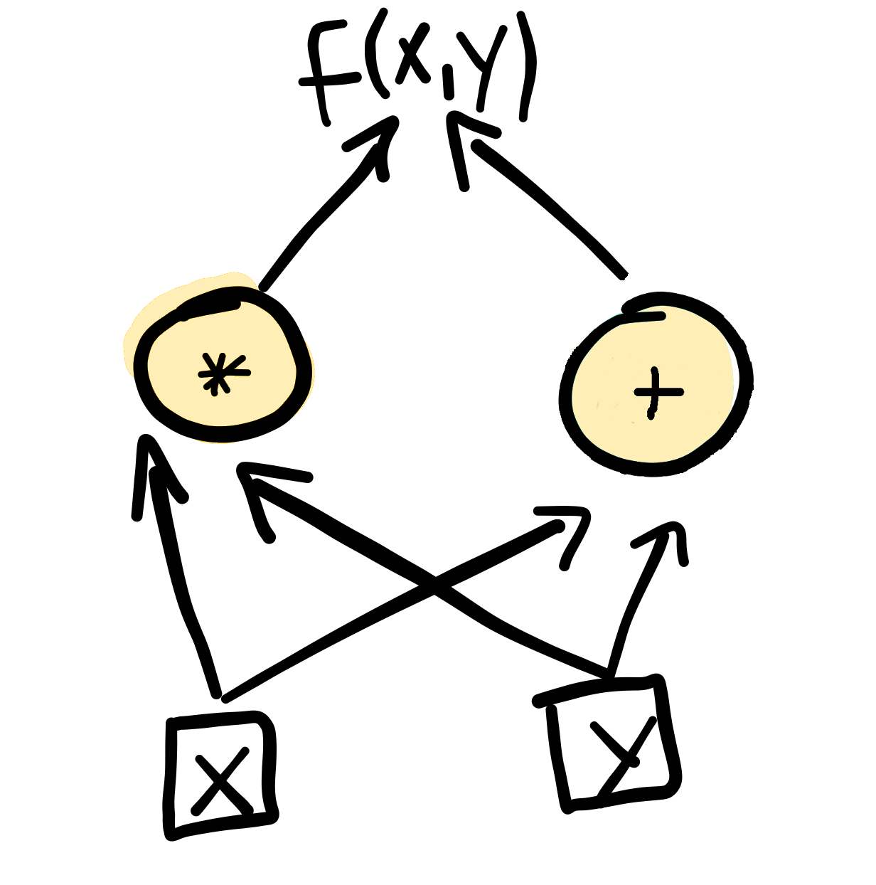
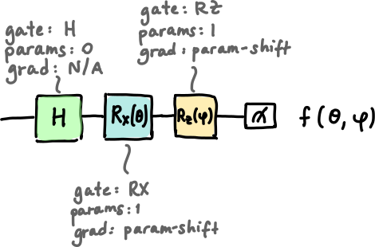
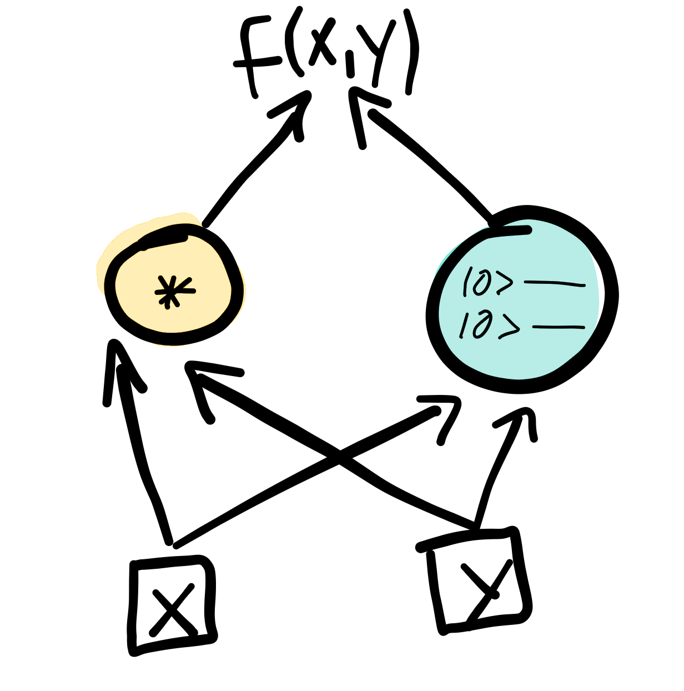

.. role:: html(raw)
   :format: html

.. _glossary_quantum_differentiable_programming:

Quantum Differentiable Programming
================================== 

In quantum computing, one can automatically compute the derivatives of
:doc:`variational circuits </glossary/variational_circuit>` with respect to
their input parameters. Quantum differentiable programming is a paradigm that
leverages this to make quantum algorithms differentiable, and thereby trainable.

Classical `differentiable programming
<https://en.wikipedia.org/wiki/Differentiable_programming>`_ is a style of
programming that uses `automatic differentiation
<https://en.wikipedia.org/wiki/Automatic_differentiation>`_ to compute the
derivatives of functions with respect to program inputs.  Differentiable
programming is closely related to deep learning, but has some conceptual
differences. In many early deep learning frameworks, the structure of models
such as neural networks, such as the number of nodes and hidden layers, is
defined statically. This is know as a "define-and-run" approach. The network is
differentiable and trained using automatic differentiation and backpropagation,
but the fundamental structure of the program doesn't change.

In contrast, more recent approaches use a "define-by-run" scheme, in which there
is no underlying assumption to how the model is structured. The models are
composed of parameterized function blocks, and the structure is dynamic - it may
change depending on the input data, yet still remains trainable and
differentiable.  A critical aspect of this is that it holds true even in the
presence of classical control flow such as for loops and if statements. These
ideas allow us to use diffentiable programming in hybrid classical-quantum
computations and make the entire program differentiable end-to-end.

.. figure:: ../_static/concepts/hybrid_graph.png
    :align: center
    :width: 90%
    :target: javascript:void(0);

    In quantum differentiable programming, hybrid computations consisting of
    both classical (yellow) and quantum (blue) components are automatically
    differentiable.

Types of differentiation in programming
---------------------------------------

Derivatives and gradients are ubiquitous throughout science and engineering.  In
recent years, automatic differentiation has become a key feature in many
numerical software libraries, in particular for machine learning (e.g., Theano_,
Autograd_, Tensorflow_, Pytorch_, or Jax_).

Generally speaking, automatic differentiation is the ability for a software
library to compute the derivatives of arbitrary numerical code. To better
understand how it works and what the benefits are, it is instructive to analyze
two other forms of differentiation that are used in software: symbolic
differentation, and numerical differentiation.

Symbolic differentation
~~~~~~~~~~~~~~~~~~~~~~~

This method of differentiation is one you may be familiar with from calculus
class. Symbolic differentiation manipulates expressions directly to determine
the mathematical form of the gradient. Both the input and output of the
procedure are mathematical expressions. For example, consider the function
:math:`\sin(x)`. Symbolic differentiation produces

.. math::

   \frac{d(\sin(x))}{dx} = \cos(x)

Computer algebra systems such as Mathematica perform symbolic differentiation
--- if you ask it for the derivative of :math:`\sin(x)`, it will return to you
explicitly the function :math:`\cos(x)`, and not a numerical value. Under the
hood, a set of differentiation rules are implemented and followed. This includes
things like how to differentiate constants, polynomials, sums, and chain rules,
as well as derivatives of common functions (e.g., trigonometric functions). This
is a very powerful tool because once the set of rules is implemented, we can
symbolically differentiate arbitrary functions that are encompassed by
them. However the scope of this method can be limited since it requires
"hand-written" support for new functions.

Numerical differentiation
~~~~~~~~~~~~~~~~~~~~~~~~~

Symbolic differentation may not be always be possible when a function falls
outside the set of implementated rules. It may also be very computationally
complex. An alternative in these situations is to compute an approximation to
the derivative numerically --- this is something that can *always* be
done. There exist `a variety of such numerical methods
<https://en.wikipedia.org/wiki/Numerical_differentiation>`_, a common one being
the finite difference method. For this method the derivative is computed by
evaluating the function at two infinitesimally separated points. For example, we
can approximately compute the derivative of :math:`\sin(x)` as follows:

.. math::

   \frac{d(\sin(x))}{dx} \approx \frac{\sin(x + \epsilon) - \sin(x - \epsilon)}{2\epsilon}

The quality of this approximation depends on the size of :math:`\epsilon`. A
smaller :math:`\epsilon` is ideal, however this can quickly cause a calculation
to become unstable and can introduce floating point errors. So while numerical
differentiation is always possible, it does not necessarily produce the best
results for the problem at hand.

Automatic differentiation
~~~~~~~~~~~~~~~~~~~~~~~~~

If you write an algorithm to compute some function :math:`f(x, y)` (which may
include mathematical expressions, but also control flow statements like
:code:`if`, :code:`for`, etc.), then automatic differentiation provides an
algorithm for :math:`\nabla f(x, y)` with the same degree of complexity as the
original function.

Automatic differentiation is a numerical approach, but what distinguishes it
from methods like finite differences is that it is an *exact* method of
differentiation. In a similar vein as symbolic differentiation, each component
of the computation provides a rule for its derivative with respect to its
inputs. However, instead of the input and output both being mathematical
expressions, the output of automatic differentiation is the numerical value of
the derivative.

To perform automatic differentiation, functions are first translated into
computational graphs in terms of elementary operations that have known
derivatives, such as addition and multiplication.

:html:` `

:html:` `

Computational graphs like this highlight the dependencies between all the
parameters. To perform differentiation with respect to a particular input
parameter, each node will contain information that contributes to the derivative
at that point in the graph. These are then combined and propagated through using
the chain rule and the differentiation rules specific to every operation. For
example, nodes that perform addition and multiplication compute derivatives using
the following rules:

:html:` `

The computational graph below shows the process for differentiating the function
:math:`f(x, y) = xy + (x + y)` with respect to :math:`x` at the point
:math:`(x, y) = (2, 3)`. Symbolically we can compute that :math:`\frac{\partial
f}{\partial x} = y + 1`, which gives a gradient of 4. Using automatic
differentiation, the derivative with respect to :math:`x` is numerically
computed using the rules in the previous figure for each step of the
calculation, and propagated through to produce the final result.

.. figure:: ../_static/concepts/autodiff.gif
    :align: center
    :width: 100%
    :target: javascript:void(0);

:html:` `

From this example, you can see that the computation can be arbitrarily extended
to include more nodes and variables, and different elementary operations
(provided their derivatives are known). When there is classical control flow,
such as an :code:`if` statement, the computational graph branches and
gradients are only computed in the branch where the criteria is satisfied.

.. note::

   The method of computing the gradient shown in the animation is known as a
   "forward" method, since the values of the gradient are computed in the same
   direction of the computation. There are also "backwards" methods, a famous
   one being the `backpropagation
   <https://en.wikipedia.org/wiki/Backpropagation>`_ used for training neural
   networks.

Automatic differentiation of quantum computations
-------------------------------------------------

The ability to compute :doc:`quantum gradients </glossary/quantum_gradient>`
means that quantum computations can become part of automatically differentiable
:doc:`hybrid computation </glossary/hybrid_computation>` pipelines. For example,
in PennyLane parameterized quantum operations carry information about their
parameters and specify a "recipe" that details how to automatically compute
gradients.

:html:` `

:html:` `

Many quantum operations make use of :doc:`parameter-shift rules
</glossary/parameter_shift>` for this purpose. Parameter-shift rules bear some
resemblance to the finite difference method presented above. They involve
expressing the gradient of a function as some combination of that function at
two different points. However, unlike in the finite difference methods, those
two points are not infinitesimally close together, but rather quite far
apart. For example,

.. math::

   \frac{d(\sin(x))}{dx} = \cos(x) = \frac{\sin(x + s) - \sin(x-s)}{2 \sin(s)}

where :math:`s` is a large value, such as :math:`\pi/2`. The formula here comes
from trigonometric identities relating :math:`\cos` and :math:`\sin`. This not only
provides us with an *exact* derivative, but also handles the issue of instability in
finite differences that occurs when we must use a small shift.

This can be extended directly to the gradients of quantum operations and entire
quantum circuits (see, for example, the arbitrary unitary rotation
:class:`~.pennylane.Rot` which uses parameter-shift rules to compute the
derivative with respect to each of its three parameters). We simply evaluate the
circuit at two different points in parameter space. In this way, the gradient of
arbitrary sequences of parameterized gates can be computed. Once evaluated the
gradients can be fed forward into subsequent parts of a larger hybrid
computation.

:html:` `

.. _Theano: https://github.com/Theano/Theano
.. _Autograd: https://github.com/HIPS/autograd
.. _Tensorflow: http://tensorflow.org/
.. _Pytorch: https://pytorch.org/
.. _Jax: https://github.com/google/jax
