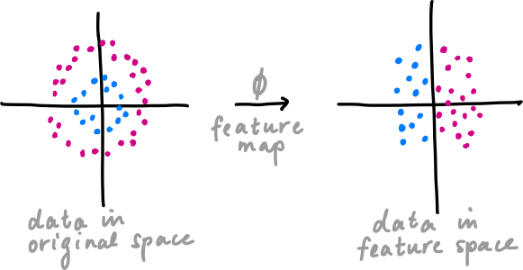
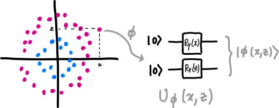

.. role:: html(raw)
   :format: html

.. _glossary_quantum_feature_map:

Quantum Feature Map
===================

Many classical machine learning methods re-express their input data in a
different space to make it easier to work with, or because the new space may
have some convenient properties. A common example is `support vector machines
<https://en.wikipedia.org/wiki/Support_vector_machine>`_, which classify data
using a linear hyperplane. A linear hyperplane works well when the data is
already linearly separable in the original space, however this is unlikely to be
true for many data sets. To work around this it may be possible to transform the
data into a new space where it is linear by way of a *feature map*.

More formally, let :math:`\cal{X}` be a set of input data. A feature map
:math:`\phi` is a function that acts as :math:`\phi : \cal{X} \rightarrow
\cal{F}` where :math:`\cal{F}` is the feature space. The outputs of the map on
the individual data points, :math:`\phi(x)` for all :math:`x \in \cal{X}`, are
called feature vectors.

    A feature map can transform data into a space where it is easier to process.

In general :math:`\cal{F}` is just a vector space — a *quantum feature map*
:math:`\phi : \cal{X} \rightarrow \cal{F}` is a feature map where the vector
space :math:`\cal{F}` is a Hilbert space and the feature vectors are quantum
states. The map transforms :math:`x \rightarrow |\phi(x)\rangle` by way of a
unitary transformation :math:`U_{\phi}(x)`, which is typically a
:doc:`variational circuit </glossary/variational_circuit>` whose parameters
depend on the input data.

For some more detailed examples of quantum feature maps, see the entry for
:doc:`quantum embeddings </glossary/quantum_embedding>`, and the key references `Schuld &
Killoran (2018) <https://arxiv.org/abs/1803.07128>`_, and `Havlicek et al. (2018) <https://arxiv.org/abs/1804.11326>`_.
