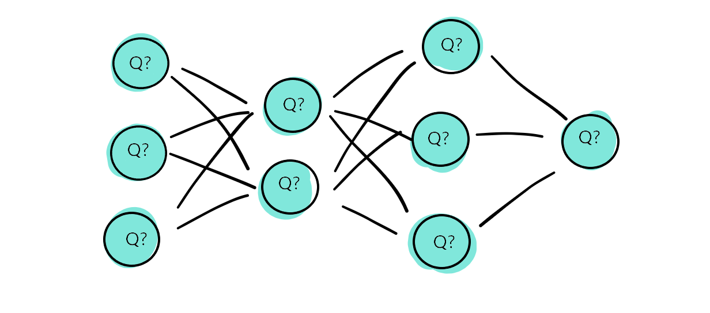
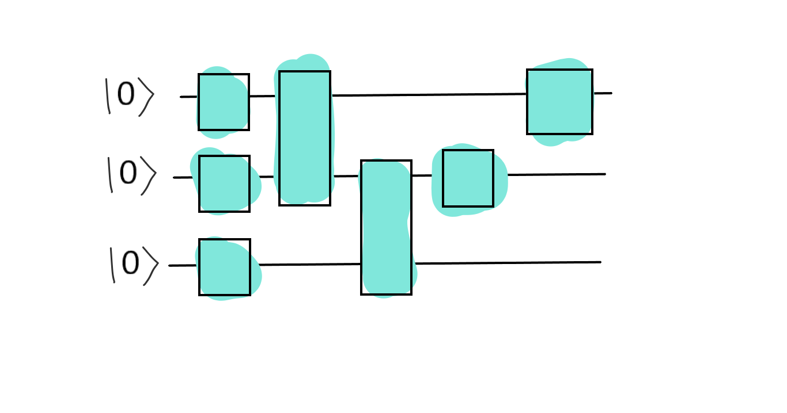

.. role:: html(raw)
   :format: html

.. _glossary_quantum_neural_network:

Quantum Neural Network
----------------------

A quantum neural network (QNN) is a machine learning model or algorithm that combines concepts from **quantum computing** and **artifical neural networks**. 

Over the past decades, the term has been used to describe a variety of ideas, ranging from quantum computers *emulating* the exact computations of neural nets, to general *trainable* quantum circuits that bear only little resemblence with the multi-layer perceptron structure.

Quantum versions of feed-forward neural networks
~~~~~~~~~~~~~~~~~~~~~~~~~~~~~~~~~~~~~~~~~~~~~~~~

Already in the 1990s, quantum physicists have tried to come up with "quantum" versions of recurrent and feed-forward neural networks `Schuld et al. (2014) <https://arxiv.org/abs/1408.7005>`_. The models were attempts to recover the modular structure as well as the nonlinear activation function of neural networks in the language of quantum algorithms. However, chains of linear and nonlinear computations are rather "unnatural" for quantum computers. [#]_ 

Also more recent research has tried to tackle this problem, and suggested special measurement schemes, or modifications of the neural nets that make them more ameneable to quantum computing, but the advantage of these models for machine learning is still not conclusively established.

Quantum versions of Boltzmann machines
~~~~~~~~~~~~~~~~~~~~~~~~~~~~~~~~~~~~~~

Boltzmann machines, which are probabilistic graphical models that can be understood as stochastic recurrent neural networks, play an important role in the quantum machine learning literature. For example, it was suggested to use samples from a quantum computer to train classical Boltzmann machines, or to interpret spins as physical units of a "quantum" Boltzmann machine model.

Variational circuits 
~~~~~~~~~~~~~~~~~~~~

Increasingly, the term "quantum neural network" is used in a much looser analogy to refer to variational or parametrized quantum circuits. While mathematically rather different from the inner workings of neural networks, the name highlights  the "modular" nature of quantum gates in a circuit, as well as the wide use of tricks from training neural networks used in the optimization of quantum algorithms. 

.. rubric:: Footnotes

.. [#] This is not necessarily true for photonic quantum computers, which allow for very natural implementations of neural nets (see for example `Killoran et al. (2018) <https://arxiv.org/abs/1806.06871>`_ and `Steinbrecher et al. <https://arxiv.org/abs/1808.10047>`_).
