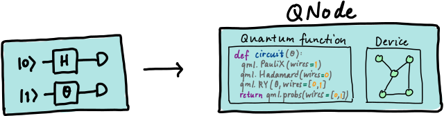

.. role:: html(raw)
   :format: html

.. _glossary_quantum_node:

Quantum Node
============

In :doc:`hybrid computation </glossary/hybrid_computation>`, algorithms
may consist of a mixture of classical and quantum components.

.. figure:: ../_static/concepts/hybrid_graph.png
    :align: center
    :width: 90%
    :target: javascript:void(0);

In PennyLane, these units of quantum computations are represented using an
object called a *quantum node*, or :func:`~.pennylane.QNode`. A quantum node
consists of a quantum function (such as a :doc:`variational circuit
</glossary/variational_circuit>`), and a device on which it executes.

.. note::

    In PennyLane, quantum nodes can be constructed by using either the
    :func:`~.pennylane.qnode` decorator, or the :func:`~.pennylane.QNode` constructor.
