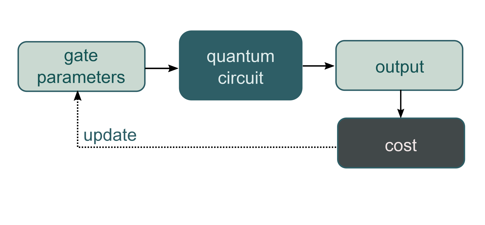

.. role:: html(raw)
   :format: html

.. _glossary_variational_circuit:

Variational circuits
====================

*Variational circuit are also known as "Parametrized Quantum Circuits".*

Adaptable quantum circuits
--------------------------

Variational or parametrized quantum circuits are quantum algorithms that depend on free parameters. Like standard
quantum circuits, they consist of three ingredients:

1. Preparation of a fixed **initial state** (e.g., the vacuum state or the zero state).

2. A **quantum circuit** :math:`U(\mathbf{\theta})`, parameterized by
   a set of free parameters :math:`\mathbf{\theta}`.

3. **Measurement** of an observable :math:`\hat{B}` at the output. This observable may be made
   up from local observables for each wire in the circuit, or just a subset of wires.

Typically, the expectation values
:math:`f(\mathbf{\theta})=\langle 0 | U^\dagger(\mathbf{\theta}) \hat{B} U(\mathbf{\theta}) | 0 \rangle`
of one or more such circuits — possibly with some classical post-processing — define a scalar cost for a
given task. The free parameters :math:`\mathbf{\theta}` of the circuit(s) are tuned to optimize this cost function.

:html:` `

    The principle of a *variational circuit*.

:html:` `

Variational circuits are trained by a classical optimization algorithm that makes queries to
the quantum device. The optimization is usually an iterative scheme that searches out better candidates for
the parameters :math:`\theta` with every step.

Variational circuits have become popular as a way to think about quantum algorithms for near-term quantum devices.
Such devices can only run short gate sequences, since without fault tolerance every gate increases
the error in the output.
Usually, a quantum algorithm is decomposed into a set of standard elementary operations,
which are in turn implemented by the quantum hardware.

The intriguing idea of variational circuit for near-term devices is to merge
this two-step procedure into a single step by "learning" the circuit on the noisy device for a given task.
This way, the "natural" tunable gates of a device can be used to formulate the algorithm, without the
detour via a fixed elementary gate set. Furthermore, systematic errors can automatically be corrected
during optmization.

Building the circuit
--------------------

:html:` `

.. figure:: ../_static/concepts/circuit_embedding.svg
    :align: center
    :width: 70%
    :target: javascript:void(0);

:html:` `

The variational parameters :math:`\theta`, possibly together with an additional set of non-adaptable
parameters :math:`x`, enter the quantum circuit as arguments for the circuit's gates.
This allows us to convert *classical information* (the values :math:`\theta` and :math:`x`)
into *quantum information* (the quantum state :math:`U(x;\mathbf{\theta})|0\rangle`). As we will see in the
example below, the non-adaptable gate parameters usually play the role of *data inputs* in quantum machine learning.

Quantum information is turned *back into classical information* by evaluating the
expectation value of the observable :math:`\hat{B}`,

.. math:: f(x; \mathbf{\theta}) = \langle \hat{B} \rangle = \langle 0 | U^\dagger(x;\mathbf{\theta})\hat{B}U(x;\mathbf{\theta}) | 0 \rangle.

Beyond the basic rule that the parameters :math:`\mathbf{\theta}` are used as the arguments of gates,
exactly how the gates are arranged, the *circuit architecture*, is essentially arbitrary.

.. note:: As shown in the figure above, the circuit can also include additional gates :math:`U` which
          have no free parameters associated with them.

Example
-------

As an example, consider a *variational quantum classifier* which uses two variational circuits: The first circuit
associates the gate parameters with fixed data inputs, while the second circuit depends on free, trainable
parameters. Together with a final measurement, this setup can be interpreted as a machine learning model.

Data-embedding
~~~~~~~~~~~~~~

As explained in the section on :ref:`quantum embeddings <glossary_quantum_embeddings>`,
the first few gates in the circuit can be used to embed
the input :math:`x` into a quantum state (which functions as a feature map :cite:`schuld2018quantum`),
while the subsequent gates have parameters :math:`\mathbf{\theta}` as arguments.

As an example, consider a photonic quantum computer (similar examples can be constructed for qubits). For
simplicity, we temporarily omit the parameters :math:`\mathbf{\theta}`. We take the initial state to be the
*vacuum* state and the measured observable :math:`\hat{B}` to be the position operator :math:`x`. The vacuum
state has expectation value :math:`\langle\hat{x}\rangle = \langle 0 | \hat{x} | 0 \rangle = 0`.

Suppose we have an input :math:`x`, which has :math:`N` dimensions. We can embed this into a quantum circuit
with :math:`N` wires using the `displacement operator <https://en.wikipedia.org/wiki/Displacement_operator>`_.
For every component :math:`x_i` of :math:`x`, we apply :math:`D(x_i)` to wire :math:`i`.
This is called displacement embedding.

Measurement of the expectation value of the :math:`\hat{x}` operator on each wire will then give the result

.. math:: (\langle \hat{x}_1 \rangle, \cdots, \langle \hat{x}_N \rangle ) = (x_1, \dots, x_N).

Thus, the displacement gate — combined with vacuum input and position measurements — can be used to
directly encode data into a photonic quantum computer.

Data processing
~~~~~~~~~~~~~~~

Having embedded our data into a quantum state, we would now like to perform some processing. As it stands,
our example circuit currently represents the *identity* :math:`f(x)=x`, which has no free parameters. By
introducing additional gates, with parameters :math:`\mathbf{\theta}`, we can start building up more complex functions.

For clarity, we restrict to a one-dimensional input :math:`x` and add in a single rotation operator, with
free parameter :math:`\theta`. After applying this gate, the quantum node evaluated by our circuit becomes

.. math:: f(x;\theta) = x\cos(\theta).

In summary, with only two quantum gates (displacement and rotation), we can evaluate functions of the above
form using quantum circuits.

The above examples were kept very simple to illustrate the principles behind embedding data and parameters
into quantum circuits. Indeed, the function evaluated in the example is tractable classically. However, by
increasing the number of subsystems and the circuit depth, the corresponding functions can become progressively
harder to evaluate classically, and a quantum device must be used.
